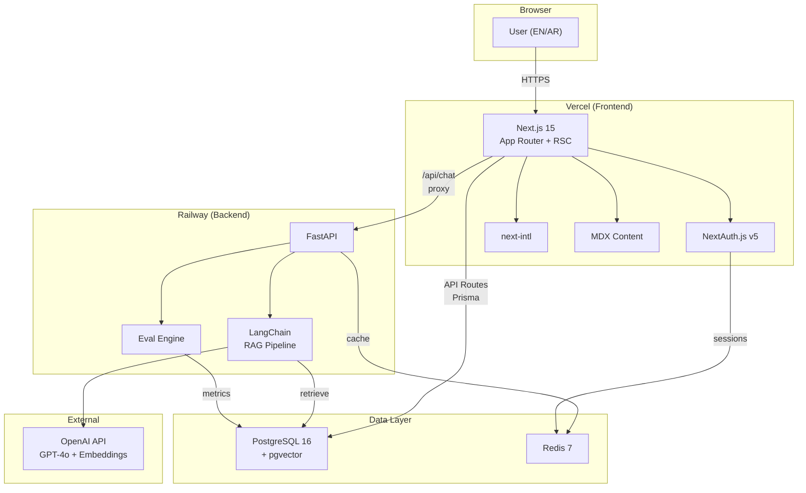

# 02.1 — Technology Stack | حزمة التقنيات

> **Status:** ✅ Complete — Ready for Review
> **Author:** Solo Developer + AI Architect
> **Date:** July 6, 2026
> **PRD Reference:** §11 Technical Architecture, §10 Non-Functional Requirements
> **ADR References:** ADR-002, ADR-003, ADR-004, ADR-005

---

## Table of Contents

1. [Decision Framework](#1-decision-framework)
2. [Stack Overview](#2-stack-overview)
3. [Frontend Stack](#3-frontend-stack)
4. [Backend Stack](#4-backend-stack)
5. [Database Stack](#5-database-stack)
6. [AI/ML Stack](#6-aiml-stack)
7. [Authentication Stack](#7-authentication-stack)
8. [Infrastructure Stack](#8-infrastructure-stack)
9. [Developer Experience](#9-developer-experience)
10. [Stack Integration Map](#10-stack-integration-map)
11. [Cost Analysis](#11-cost-analysis)
12. [Risk Assessment](#12-risk-assessment)
13. [Version Pinning](#13-version-pinning)

---

## 1. Decision Framework

كل اختيار تقني في هذه الوثيقة تم تقييمه بناءً على المعايير التالية، المستمدة مباشرة من قيود الـPRD:

| Criterion | Weight | Source | Why This Weight |
|-----------|--------|--------|-----------------|
| **Arabic/RTL First-class Support** | 🔴 Critical | PRD §10, Epic B | Arabic is a hard requirement, not a nice-to-have. Any technology that treats RTL as an afterthought is disqualified |
| **Free-tier Viability** | 🔴 Critical | PRD §14.4 | Budget assumed near-zero. Technologies requiring paid plans from day one are rejected |
| **Solo Developer Velocity** | 🟠 High | PRD §7 | Solo project — every technology must accelerate, not slow down, a single developer |
| **Production-grade Credibility** | 🟠 High | PRD §4.3 | The stack itself is part of the Engineering Evidence. It must read as a deliberate, defensible choice |
| **AI/ML Ecosystem Compatibility** | 🟠 High | PRD §8 E1/E2 | RAG assistant and eval dashboard are Must-haves. The stack must natively support LLM workflows |
| **SEO/Performance** | 🟡 Medium | PRD §10.6 | Core Web Vitals and Lighthouse scores matter for discoverability, but don't override core requirements |
| **Community & Longevity** | 🟡 Medium | — | Technologies with strong communities reduce solo-developer risk of getting stuck |

> [!IMPORTANT]
> **القاعدة الأولى:** إذا كانت التقنية لا تدعم العربية/RTL بشكل أصيل، فهي مرفوضة بغض النظر عن مزاياها الأخرى.
> **Rule #1:** If a technology doesn't support Arabic/RTL natively, it's rejected regardless of other merits.

---

## 2. Stack Overview

```
┌─────────────────────────────────────────────────────────────┐
│                        CLIENT (Browser)                      │
│                                                              │
│  Next.js 15 (App Router) + TypeScript + Tailwind CSS         │
│  next-intl (i18n) + Framer Motion (animations)               │
│  MDX (content) + React Server Components                     │
└────────────────────────┬────────────────────────────────────┘
                         │ HTTPS
                         ▼
┌─────────────────────────────────────────────────────────────┐
│                     API LAYER                                │
│                                                              │
│  Next.js API Routes          FastAPI (Python 3.12)           │
│  (BFF — auth, SSR data)      (AI/ML endpoints)               │
│                                                              │
│  ┌─────────────┐             ┌──────────────────┐           │
│  │ NextAuth.js  │             │ LangChain        │           │
│  │ (Auth)       │             │ (RAG Pipeline)   │           │
│  └─────────────┘             └──────────────────┘           │
└──────┬─────────────────────────────┬────────────────────────┘
       │                             │
       ▼                             ▼
┌──────────────┐            ┌──────────────────┐
│  PostgreSQL  │            │  Redis            │
│  + pgvector  │            │  (Cache/Sessions) │
└──────────────┘            └──────────────────┘
       │
       ▼
┌──────────────┐
│  OpenAI API  │
│  (GPT-4o +   │
│   Embeddings)│
└──────────────┘
```

### Quick Reference Table

| Layer | Technology | Version | License |
|-------|-----------|---------|---------|
| **Frontend Framework** | Next.js | 15.x | MIT |
| **Language (Frontend)** | TypeScript | 5.x | Apache-2.0 |
| **Styling** | Tailwind CSS | 4.x | MIT |
| **Animations** | Framer Motion | 12.x | MIT |
| **i18n** | next-intl | 4.x | MIT |
| **Content** | MDX | 3.x | MIT |
| **Backend Framework** | FastAPI | 0.115+ | MIT |
| **Language (Backend)** | Python | 3.12 | PSF |
| **ORM (Backend)** | SQLAlchemy | 2.x | MIT |
| **ORM (Frontend)** | Prisma | 6.x | Apache-2.0 |
| **Database** | PostgreSQL | 16 | PostgreSQL |
| **Vector Extension** | pgvector | 0.8+ | PostgreSQL |
| **Cache** | Redis | 7.x | BSD-3 |
| **Auth** | NextAuth.js | 5.x (Auth.js) | ISC |
| **LLM Provider** | OpenAI API | GPT-4o | Commercial |
| **Embeddings** | OpenAI | text-embedding-3-small | Commercial |
| **RAG Framework** | LangChain | 0.3+ | MIT |
| **Validation** | Zod (TS) / Pydantic (Py) | Latest | MIT |

---

## 3. Frontend Stack

### 3.1 Framework: Next.js 15 (App Router)

**Decision:** Next.js 15 with App Router

**ADR:** ADR-002

#### لماذا Next.js؟

| Factor | Next.js 15 | Assessment |
|--------|-----------|------------|
| **SSR/SSG/ISR** | Full support — static for content pages, SSR for dynamic, ISR for blog | ✅ Critical for SEO in both EN and AR |
| **App Router** | Nested layouts, server components, streaming | ✅ Natural fit for `/{locale}/` routing pattern |
| **i18n Routing** | `[locale]` dynamic segments natively supported | ✅ `/{en|ar}/projects` works out of the box |
| **React Ecosystem** | Largest component ecosystem | ✅ Solo developer can leverage existing solutions |
| **Vercel Deployment** | Zero-config deploy, free tier | ✅ Matches free-tier-first constraint |
| **TypeScript** | First-class support | ✅ Type safety for a solo project reduces bugs |
| **MDX Support** | Built-in via `@next/mdx` | ✅ Case studies and blog posts as MDX files |
| **Image Optimization** | `next/image` with automatic WebP/AVIF | ✅ Performance without manual optimization |

#### البدائل المدروسة والمرفوضة

| Alternative | Strengths | Why Rejected |
|-------------|-----------|--------------|
| **Remix** | Better data loading patterns, progressive enhancement | Smaller ecosystem, Vercel deployment less mature, i18n requires more manual setup, React Router v7 migration adds uncertainty |
| **Nuxt 3 (Vue)** | Excellent DX, good SSR | Vue ecosystem — smaller community for AI/ML integrations, switching cost for React-familiar developers, fewer UI component libraries |
| **SvelteKit** | Best performance, elegant syntax | Smallest ecosystem of all options, fewer production references at scale, risky for a portfolio meant to demonstrate production maturity |
| **Astro** | Best for content-heavy sites, partial hydration | Insufficient for interactive features (chat widget, eval dashboard). Would require a separate SPA for Epic E1/E2, creating two codebases |
| **Gatsby** | Pioneer of React SSG | Declining ecosystem, Netlify acquisition created uncertainty, build times at scale, less investment in new features |

> [!NOTE]
> **لماذا ليس Astro رغم أن الموقع يحتوي على محتوى كثير؟**
> Astro ممتاز للمحتوى الثابت، لكن Epic E1 (RAG chat) وEpic E2 (eval dashboard) يتطلبان تفاعلية عالية — WebSocket للمحادثات الحية، رسوم بيانية متحركة، تحديثات فورية. مع Astro سنحتاج لتضمين React كـ"island" على أي حال، مما يُلغي ميزة الأداء الأساسية ويُنشئ تعقيداً معمارياً غير مبرر.

---

### 3.2 Language: TypeScript 5.x

**Decision:** TypeScript — strict mode enabled

**Rationale:**
- **Type safety** — A solo developer's best defense against runtime errors
- **Intellisense** — IDE autocomplete reduces context-switching to documentation
- **API contracts** — Types shared between frontend and API routes catch breaking changes at compile time
- **Interview signal** — TypeScript is the expected standard at Tier 1 and Tier 2 target companies

**Configuration:**
```jsonc
// tsconfig.json — strict mode, no shortcuts
{
  "compilerOptions": {
    "strict": true,
    "noUncheckedIndexedAccess": true,
    "noImplicitReturns": true,
    "exactOptionalPropertyTypes": true
  }
}
```

---

### 3.3 Styling: Tailwind CSS 4.x

**Decision:** Tailwind CSS 4 with CSS-first configuration

#### لماذا Tailwind وليس بديل آخر؟

| Factor | Tailwind CSS 4 | Assessment |
|--------|---------------|------------|
| **RTL Support** | `rtl:` variant — `rtl:mr-4` becomes `ml-4` in RTL | ✅ First-class, not a hack |
| **Dark Mode** | `dark:` variant built-in | ✅ Premium feel, GCC user preference |
| **Responsive** | `sm:`, `md:`, `lg:` — mobile-first by default | ✅ Responsive without media query boilerplate |
| **Design System** | CSS variables in v4 — single source of truth for tokens | ✅ Consistent colors, spacing, typography |
| **Bundle Size** | Automatic tree-shaking — only used classes in production | ✅ Performance |
| **Speed** | Utility-first = less CSS to write and maintain | ✅ Solo developer velocity |

| Alternative | Why Rejected |
|-------------|--------------|
| **CSS Modules** | More verbose, no built-in RTL variant, no design system tokens, slower development velocity |
| **Styled Components / Emotion** | Runtime CSS-in-JS cost, poor SSR performance, React Server Components incompatibility |
| **Chakra UI / Mantine** | Opinionated component library — limits design differentiation, and the portfolio should look unique, not template-like |
| **Vanilla CSS** | Maximum control but maximum time cost — not justified for a solo project with a 4-6 week MVP timeline |

**RTL Implementation Pattern:**
```html
<!-- Tailwind handles RTL automatically with logical properties -->
<div class="ps-4 pe-8 text-start">
  <!-- ps = padding-inline-start, pe = padding-inline-end -->
  <!-- Works correctly in both LTR (English) and RTL (Arabic) -->
</div>

<!-- For cases needing explicit RTL overrides -->
<div class="ml-4 rtl:ml-0 rtl:mr-4">
  <!-- Explicit RTL override when logical properties aren't enough -->
</div>
```

---

### 3.4 Animations: Framer Motion 12.x

**Decision:** Framer Motion for page transitions and micro-interactions

**Rationale:**
- Layout animations for page transitions (critical for portfolio "wow factor")
- `AnimatePresence` for route change animations
- Gesture support (drag, hover, tap) for interactive elements
- Server Component compatible via `"use client"` boundary
- Lightweight alternative to GSAP for the scope we need

**Scope discipline:** Animations for page transitions, scroll reveals, hover states, and the chat widget. **Not** for complex SVG animations or 3D — those are future backlog items if warranted by evidence.

---

### 3.5 i18n: next-intl 4.x

**Decision:** next-intl for internationalization

#### لماذا next-intl وليس next-i18next؟

| Factor | next-intl | next-i18next |
|--------|-----------|-------------|
| **App Router support** | ✅ Native, built for it | ⚠️ Partial, still evolving |
| **Server Components** | ✅ Full support | ❌ Requires client components |
| **Type-safe translations** | ✅ TypeScript integration | ⚠️ Limited |
| **Message format** | ICU MessageFormat | JSON keys |
| **Routing** | Built-in `[locale]` middleware | Manual setup |
| **Bundle size** | Smaller (server-rendered) | Larger (client-side) |

**Translation File Structure:**
```
messages/
├── en.json          ← English translations
└── ar.json          ← Arabic translations
```

**Key Architecture Decision — Content vs. UI translations:**
- **UI strings** (buttons, labels, navigation) → `next-intl` JSON files
- **Long-form content** (case studies, blog posts) → Separate MDX files per locale (`/content/en/`, `/content/ar/`)

This split avoids bloating translation JSON files with thousands of words of case-study content.

---

### 3.6 Content: MDX 3.x

**Decision:** MDX for case studies, blog posts, and experience pages

**Rationale:**
- Markdown for content writers (future-proof if content team grows)
- React components embedded in content (interactive code blocks, charts, callouts)
- Git-based — all content versioned alongside code
- Static generation at build time — zero runtime cost for content pages
- Aligns with PRD §11.2: "static (MDX/git-based)"

**Content Architecture:**
```
content/
├── en/
│   ├── experience/
│   │   ├── amazon.mdx
│   │   └── grammarly.mdx
│   ├── projects/
│   │   ├── rag-assistant.mdx
│   │   └── eval-dashboard.mdx
│   └── blog/
│       ├── 001-post-slug.mdx
│       └── 002-post-slug.mdx
└── ar/
    ├── experience/
    │   ├── amazon.mdx
    │   └── grammarly.mdx
    ├── projects/
    │   ├── rag-assistant.mdx
    │   └── eval-dashboard.mdx
    └── blog/
        ├── 001-post-slug.mdx
        └── 002-post-slug.mdx
```

---

## 4. Backend Stack

### 4.1 Framework: FastAPI 0.115+

**Decision:** FastAPI as the AI/ML backend service

**ADR:** ADR-003

#### لماذا FastAPI؟ — ولماذا نحتاج backend منفصل أصلاً؟

**السؤال الأول: لماذا لا نستخدم Next.js API Routes لكل شيء؟**

| Concern | Next.js API Routes | FastAPI | Winner |
|---------|-------------------|---------|--------|
| **LLM Integration** | Via npm packages (less mature) | Native Python ecosystem (LangChain, OpenAI SDK, HuggingFace) | FastAPI |
| **Streaming responses** | Supported but awkward | Native `StreamingResponse`, async generators | FastAPI |
| **ML/Data processing** | Python subprocess calls = ugly | Native Python = natural | FastAPI |
| **Vector operations** | Limited libraries | NumPy, SciPy, sentence-transformers all native | FastAPI |
| **Simple CRUD** | Excellent — Prisma + API routes | Works but overkill | Next.js |
| **Auth/Sessions** | NextAuth.js = purpose-built | Manual JWT handling | Next.js |
| **SEO data fetching** | Server Components = ideal | Requires API call from Next.js | Next.js |

**الخلاصة:** معمارية **BFF (Backend for Frontend)**:
- **Next.js API Routes** → Auth, SSR data fetching, simple CRUD, BFF proxy
- **FastAPI** → AI/ML endpoints, RAG pipeline, evaluation engine, streaming chat

هذا ليس over-engineering — هذا تقسيم مسؤوليات على أساس اللغة المناسبة لكل مهمة.

#### لماذا FastAPI وليس بديل آخر؟

| Alternative | Strengths | Why Rejected |
|-------------|-----------|--------------|
| **Django + DRF** | Battle-tested, admin panel, ORM | Heavier than needed for an AI microservice, synchronous by default (async support is bolted on), admin panel not needed (we have our own Epic I) |
| **Flask** | Simple, lightweight | No async support, no auto OpenAPI docs, no type validation, no streaming — would need 5+ extensions to match FastAPI's built-in features |
| **Express.js (Node)** | Same language as frontend | Python ML ecosystem is irreplaceable for RAG. Would need Python subprocess calls or a separate Python service anyway — worse than just using FastAPI directly |
| **NestJS (Node)** | Enterprise patterns, TypeScript | Same Python ecosystem problem as Express. NestJS adds boilerplate (decorators, modules, providers) that slows a solo developer |
| **LangServe** | Built for LangChain deployment | Too opinionated, limited to LangChain patterns, not suitable for custom eval dashboard endpoints |

#### FastAPI — Key Capabilities Used

```python
# Auto-generated OpenAPI docs → localhost:8000/docs
# Type validation via Pydantic → catch errors before they hit the DB
# Async by default → handle concurrent chat sessions
# Streaming → SSE for real-time chat responses
# Dependency injection → clean auth middleware

from fastapi import FastAPI
from fastapi.responses import StreamingResponse

app = FastAPI(
    title="bashar.ai API",
    description="AI/ML backend for the Digital Headquarters",
    version="1.0.0",
)

@app.post("/api/v1/chat")
async def chat(request: ChatRequest) -> StreamingResponse:
    """Bilingual RAG chat endpoint with streaming."""
    ...
```

---

### 4.2 Language: Python 3.12

**Rationale:**
- **ML ecosystem** — The entire AI/ML world runs on Python. LangChain, OpenAI SDK, sentence-transformers, NumPy — all Python-native
- **3.12 specifically** — Performance improvements (10-15% faster), better error messages, `type` statement for type aliases
- **Interview signal** — Python proficiency is expected for LLM/AI Application Engineer roles (PRD target role)

---

### 4.3 Validation: Pydantic v2 (Python) + Zod (TypeScript)

**Decision:** Pydantic for Python, Zod for TypeScript — same validation philosophy, two languages

**Rationale:**
- Both are schema-first — define the shape, get validation free
- Both produce clear error messages (important for bilingual error handling, §02.9)
- Pydantic v2 is 5-50x faster than v1 (Rust core)
- Zod integrates with React Hook Form for frontend validation

**Shared Contract Pattern:**
```
User submits form (Zod validates client-side)
    → Next.js API route (Zod validates server-side)
        → FastAPI endpoint (Pydantic validates again)
```
Three layers of validation. No invalid data reaches the database.

---

## 5. Database Stack

### 5.1 Primary Database: PostgreSQL 16

**Decision:** PostgreSQL 16 as the single primary database

**ADR:** ADR-005

#### لماذا PostgreSQL؟

| Factor | PostgreSQL | Assessment |
|--------|-----------|------------|
| **ACID Compliance** | Full ACID transactions | ✅ Data integrity for user sessions, analytics, evaluations |
| **JSON Support** | `jsonb` — store, query, index JSON natively | ✅ Flexible schema for blog metadata, project data |
| **Vector Extension** | pgvector — embeddings in the same DB | ✅ No separate vector service needed (cost = $0) |
| **Full-text Search** | Built-in `tsvector` with Arabic stemming support | ✅ Site search without Elasticsearch |
| **Free Tier** | Supabase (500MB), Neon (512MB), Railway ($5 credit) | ✅ Matches free-tier-first constraint |
| **Proven at Scale** | Instagram, Discord, Stripe, Reddit | ✅ Production credibility signal |
| **Tooling** | pgAdmin, DBeaver, psql, every ORM supports it | ✅ Solo developer never gets stuck |

#### البدائل المرفوضة

| Alternative | Why Rejected |
|-------------|--------------|
| **MongoDB** | No ACID transactions (needed for evaluation results), no native vector support, schema-less is a liability not an asset for a solo project — types catch errors that schemaless doesn't |
| **MySQL** | Weaker JSON support, no vector extension, no full-text search for Arabic, fewer free-tier hosting options |
| **SQLite** | Single-file DB — not suitable for concurrent access from Next.js + FastAPI, no vector support, no network access |
| **Supabase (as platform)** | Supabase is considered as a **hosting option** for PostgreSQL (§02.2), not as an alternative to PostgreSQL itself |

---

### 5.2 Vector Store: pgvector 0.8+

**Decision:** pgvector extension within PostgreSQL — not a separate vector database

#### لماذا pgvector وليس Pinecone أو Weaviate؟

This is the decision most worth explaining, because the "obvious" choice for RAG is a dedicated vector DB.

| Factor | pgvector | Pinecone | Weaviate |
|--------|----------|----------|----------|
| **Cost** | $0 (PostgreSQL extension) | Free tier: 1 index, 100K vectors | Free tier: 14-day sandbox only |
| **Ops Complexity** | None — same DB, same backups, same monitoring | Separate service, separate monitoring, separate auth | Self-hosted or cloud — either way, separate infra |
| **Data Locality** | Embeddings + metadata in same DB = single query joins | Separate query + metadata lookup = 2 round trips | Same issue as Pinecone |
| **Scale Ceiling** | ~1M vectors performantly with HNSW index | Billions | Millions |
| **Do We Need Scale?** | Our corpus: ~200 documents max (case studies, blog posts, resume sections) | ← This is the key question | ← Same |

> [!TIP]
> **القرار الحاسم:** مشروعنا سيحتوي على ~200 وثيقة كحد أقصى. في هذا الحجم، pgvector يعمل بأداء ممتاز ولا يبرر تكلفة وتعقيد خدمة منفصلة.
> إذا تجاوزنا 100K وثيقة (Phase 4+ بعيد المدى)، يمكن الترحيل إلى Pinecone لاحقاً بدون تغيير في الكود الأساسي لأن LangChain تدعم كلاهما كـvector store.

**Migration Safety Net:**
```python
# LangChain abstracts the vector store — switching is a config change
from langchain_community.vectorstores import PGVector  # Today
# from langchain_pinecone import PineconeVectorStore   # Future, if needed
```

---

### 5.3 ORM Strategy: Dual ORM

**Decision:** Prisma (Next.js) + SQLAlchemy 2.x (FastAPI) — both accessing the same PostgreSQL instance

**Why two ORMs?**

| Concern | Prisma | SQLAlchemy |
|---------|--------|------------|
| **Language** | TypeScript | Python |
| **Best for** | Next.js API routes, Server Components | FastAPI endpoints, ML pipelines |
| **Migrations** | `prisma migrate` — declarative, type-safe | Alembic — imperative, flexible |
| **Who owns migrations?** | ✅ Prisma owns the schema | SQLAlchemy reads the schema |

**Rule:** Prisma is the **schema owner**. All migrations run through Prisma. SQLAlchemy uses `automap_base()` or manually-defined models that mirror Prisma's schema. This avoids migration conflicts.

---

### 5.4 Cache: Redis 7.x

**Decision:** Redis for caching, rate limiting, and session storage

**Use Cases:**
| Use Case | Why Redis (not in-memory or DB) |
|----------|-------------------------------|
| **API Response Cache** | RAG responses are expensive (LLM API calls). Cache identical queries for 5 min |
| **Rate Limiting** | Token bucket per IP — protect against abuse. Redis atomic operations make this trivial |
| **Session Store** | NextAuth.js sessions — Redis adapter for horizontal scaling readiness |
| **Eval Queue** | Bull/BullMQ job queue for async evaluation runs |

**Free Tier Options:** Upstash Redis (10K commands/day free), Redis Cloud (30MB free)

---

## 6. AI/ML Stack

### 6.1 LLM Provider: OpenAI API (GPT-4o)

**Decision:** OpenAI GPT-4o as the primary LLM, with fallback strategy

**ADR:** ADR-004

#### لماذا OpenAI وليس بديل آخر؟

| Factor | GPT-4o | Claude 3.5 Sonnet | Gemini 1.5 Pro | Llama 3.1 (Self-hosted) |
|--------|--------|-------------------|----------------|------------------------|
| **Arabic Quality** | ✅ Strong | ⚠️ Adequate | ✅ Strong (Google Translate heritage) | ❌ Weak — training data skews English |
| **API Maturity** | ✅ Most mature, best docs | ✅ Good | ⚠️ Rapidly changing | ❌ No managed API — need GPU hosting |
| **Streaming** | ✅ SSE built-in | ✅ SSE built-in | ✅ SSE built-in | ⚠️ Manual via vLLM/TGI |
| **Embeddings** | ✅ Same provider, one API key | ❌ No embeddings API | ✅ Has embeddings | ❌ Separate model needed |
| **Cost (1M tokens)** | $2.50 input / $10 output | $3 input / $15 output | $1.25 input / $5 output | ~$0.50 but $50+/mo GPU |
| **Free Tier** | ❌ Pay-per-use | ❌ Pay-per-use | ✅ Free tier available | "Free" but GPU costs |
| **Function Calling** | ✅ Native, structured output | ✅ Native | ✅ Native | ⚠️ Limited |

**لماذا GPT-4o تحديداً وليس GPT-4o-mini؟**

| Scenario | Model | Rationale |
|----------|-------|-----------|
| **RAG Chat (production)** | GPT-4o-mini | Cost-effective for most queries, good Arabic |
| **RAG Chat (complex queries)** | GPT-4o | Fallback for queries that need deeper reasoning |
| **Embeddings** | text-embedding-3-small | Best cost/quality ratio, 1536 dimensions |
| **Evaluation (golden set)** | GPT-4o | Evaluator model should be stronger than the evaluated model |

**Cost Control Strategy:**
```
Average chat session: ~4 messages
Average tokens per message: ~500 input + ~300 output
GPT-4o-mini cost per session: ~$0.002 (0.2 cents)
Monthly estimate (500 sessions): ~$1.00

With GPT-4o fallback (10% of queries): ~$1.50/month total
```

> [!NOTE]
> **استراتيجية Fallback المتعددة المزودين:**
> LangChain تسمح بتبديل المزود بتغيير سطر واحد. إذا رفعت OpenAI الأسعار أو تدهورت جودة العربية، يمكن التحويل إلى Gemini (الأرخص) أو Claude (الأجود) بدون إعادة كتابة الكود.

---

### 6.2 RAG Framework: LangChain 0.3+

**Decision:** LangChain as the orchestration layer for the RAG pipeline

**Why LangChain (not raw API calls)?**

| Factor | LangChain | Raw OpenAI SDK |
|--------|-----------|----------------|
| **RAG Pipeline** | Built-in: load → split → embed → store → retrieve → generate | Manual implementation of each step |
| **Vector Store Abstraction** | Swap pgvector ↔ Pinecone with one line | Rewrite retrieval logic |
| **Document Loaders** | MDX, PDF, web pages — all built-in | Manual parsing |
| **Evaluation** | `langchain-evaluation` + LangSmith | Custom eval from scratch |
| **Prompt Templates** | Version-controlled, parameterized | String concatenation |
| **Streaming** | Built-in callback handlers | Manual SSE implementation |

**Why Not LlamaIndex?**
LlamaIndex is more opinionated about RAG patterns — excellent for simple Q&A but less flexible for our eval dashboard (Epic E2) which needs custom metrics, logging hooks, and observability integration. LangChain's callback system is more extensible for our specific needs.

---

### 6.3 Embeddings: OpenAI text-embedding-3-small

**Decision:** OpenAI's text-embedding-3-small (1536 dimensions)

| Model | Dimensions | Cost per 1M tokens | Arabic Quality | Storage per Vector |
|-------|-----------|--------------------|-----------------|--------------------|
| **text-embedding-3-small** ✅ | 1536 | $0.02 | Good | 6 KB |
| text-embedding-3-large | 3072 | $0.13 | Better | 12 KB |
| Cohere embed-multilingual-v3 | 1024 | $0.10 | Excellent Arabic | 4 KB |

**Why small, not large?**
For ~200 documents with ~1000 chunks, the quality difference is negligible. The cost difference is 6.5x. If retrieval quality proves insufficient in evaluation (Epic E2), upgrading to `text-embedding-3-large` is a one-line change + re-embedding (~$0.05 total cost for our corpus).

---

## 7. Authentication Stack

### 7.1 Auth: NextAuth.js v5 (Auth.js)

**Decision:** NextAuth.js v5 for authentication

**Scope Clarification:** The public-facing portfolio site is **mostly unauthenticated**. Auth is needed for:
1. `/admin` — CMS, analytics dashboard (Epic I)
2. Rate limiting — identify returning chat users
3. Future: saved conversations, personalized experience

| Factor | NextAuth.js v5 | Clerk | Auth0 |
|--------|---------------|-------|-------|
| **Cost** | Free (self-managed) | Free tier: 10K MAU | Free tier: 7K MAU |
| **Next.js Integration** | Native — built for it | Good SDK | Good SDK |
| **Providers** | Google, GitHub, Email, Credentials | All major | All major |
| **Session Strategy** | JWT or Database sessions | Managed | Managed |
| **Vendor Lock-in** | None — open source | High | High |
| **Setup Complexity** | Medium | Low | Low |

**Why not Clerk/Auth0?** They're excellent products, but for a portfolio site with one admin user, paying for a managed auth service or accepting vendor lock-in isn't justified. NextAuth.js is free, open-source, and purpose-built for Next.js.

---

## 8. Infrastructure Stack

### 8.1 Deployment Strategy: Vercel + Railway

| Service | Hosts | Free Tier | Why |
|---------|-------|-----------|-----|
| **Vercel** | Next.js frontend | 100GB bandwidth, serverless functions | Purpose-built for Next.js, zero-config, global CDN |
| **Railway** | FastAPI backend | $5/month credit (free trial) | Simple container deployment, PostgreSQL + Redis add-ons |
| **Supabase** (alternative) | PostgreSQL | 500MB database, 1GB storage | If Railway's DB limits are tight |
| **Upstash** | Redis | 10K commands/day | Serverless Redis, no always-on cost |

**GCC Optimization:**
- Vercel Edge Network has a presence in the Middle East (Bahrain/UAE)
- Railway can deploy to regions closer to GCC
- CDN caching for static assets reduces latency regardless of origin

> Details in [02.2-Infrastructure.md](./02.2-Infrastructure.md)

---

### 8.2 CI/CD: GitHub Actions

**Decision:** GitHub Actions for CI/CD pipeline

**Rationale:**
- Free for public repos (this portfolio's code will be public — it IS the Engineering Evidence)
- Native GitHub integration — PR checks, deployment previews
- YAML-based — version controlled alongside code
- Marketplace actions for common tasks (deploy to Vercel, run tests, lint)

---

## 9. Developer Experience

### 9.1 Development Tools

| Tool | Purpose | Why This One |
|------|---------|-------------|
| **pnpm** | Package manager (frontend) | Faster, disk-efficient, strict dependency resolution |
| **uv** | Package manager (Python) | 10-100x faster than pip, lockfile support, created by Astral (Ruff team) |
| **Biome** | Linter + Formatter (TS/JS) | Single tool replaces ESLint + Prettier, faster (Rust-based) |
| **Ruff** | Linter + Formatter (Python) | Replaces flake8 + black + isort, 100x faster |
| **Husky + lint-staged** | Git hooks | Pre-commit linting prevents broken code from entering the repo |
| **Docker Compose** | Local development | One command spins up PostgreSQL + Redis + FastAPI |

### 9.2 Monorepo Structure

```
basharai/
├── src/
│   ├── frontend/               ← Next.js application
│   │   ├── app/
│   │   │   └── [locale]/       ← i18n routing
│   │   ├── components/
│   │   ├── lib/
│   │   ├── content/            ← MDX files (EN/AR)
│   │   ├── messages/           ← UI translation JSON files
│   │   ├── prisma/
│   │   │   └── schema.prisma
│   │   ├── public/
│   │   ├── package.json
│   │   └── next.config.ts
│   │
│   └── backend/                ← FastAPI application
│       ├── app/
│       │   ├── api/
│       │   │   └── v1/
│       │   ├── core/           ← Config, security, logging
│       │   ├── models/         ← SQLAlchemy models
│       │   ├── schemas/        ← Pydantic schemas
│       │   ├── services/       ← Business logic
│       │   │   ├── rag/        ← RAG pipeline
│       │   │   └── eval/       ← Evaluation engine
│       │   └── main.py
│       ├── tests/
│       ├── pyproject.toml
│       └── Dockerfile
│
├── docs/                       ← Project documentation (you are here)
├── docker-compose.yml
└── README.md
```

---

## 10. Stack Integration Map



**Data Flow for RAG Chat (Epic E1):**
```
User types message (Arabic or English)
    → Next.js API Route (auth check, rate limit via Redis)
        → FastAPI /api/v1/chat (streaming)
            → LangChain: detect language
            → LangChain: embed query (OpenAI)
            → pgvector: similarity search (top 5 chunks)
            → LangChain: construct prompt with retrieved context
            → OpenAI GPT-4o-mini: generate response
            → Log: tokens, latency, retrieved chunks (for Epic E2)
        ← SSE stream back to browser
    ← Rendered in chat widget with typing animation
```

---

## 11. Cost Analysis

### Monthly Cost Projection (Post-Launch)

| Service | Free Tier Limit | Expected Usage | Estimated Cost |
|---------|----------------|----------------|----------------|
| **Vercel** | 100GB bandwidth | ~5GB | $0 |
| **Railway** | $5 credit | PostgreSQL + FastAPI | $0–5 |
| **Upstash Redis** | 10K commands/day | ~2K commands/day | $0 |
| **OpenAI API** | Pay-per-use | ~500 chat sessions/mo | ~$1.50 |
| **Domain** | — | bashar.ai (annual) | ~$2/mo amortized |
| **GitHub** | Free for public | — | $0 |
| | | | **Total: $3.50–8.50/mo** |

> [!IMPORTANT]
> **التكلفة الشهرية المتوقعة: $3.50–8.50** — ضمن قيد "free-tier-first" من الـPRD §14.4.
> أغلى عنصر هو OpenAI API، وحتى ذلك يمكن تقليله عبر التخزين المؤقت الذكي (Redis) للأسئلة المتكررة.

### Cost Optimization Strategies

1. **Response Caching** — Cache identical RAG queries in Redis for 5 minutes → reduces OpenAI calls by ~40%
2. **Prompt Optimization** — Minimize system prompt tokens, use chat history compression
3. **Embedding Caching** — Store chunk embeddings once, never re-embed unchanged content
4. **Static Generation** — All content pages (case studies, blog) are SSG → zero compute cost at request time

---

## 12. Risk Assessment

| Risk | Severity | Probability | Mitigation |
|------|----------|-------------|------------|
| **OpenAI API price increase** | Medium | Medium | LangChain abstraction allows switching to Gemini/Claude in <1 day |
| **Vercel free tier limits** | Low | Low | Static-heavy site with caching — unlikely to exceed 100GB |
| **pgvector performance** | Low | Low | ~200 docs × ~5 chunks = ~1000 vectors. HNSW index handles 1M+ |
| **Two-language codebase (TS+Python)** | Medium | Medium | Clear boundary: TS for frontend/BFF, Python for AI only. No overlap |
| **Prisma + SQLAlchemy conflict** | Medium | Low | Prisma owns migrations, SQLAlchemy reads-only. Tested pattern in similar projects |
| **LangChain API instability** | Medium | Medium | Pin version, use stable imports only (`langchain-core`, `langchain-community`), avoid experimental |
| **Railway free tier sunset** | Medium | Low | Alternative: Render (free tier), Fly.io (free tier), or Docker on any VPS |

---

## 13. Version Pinning

> [!WARNING]
> **كل إصدار مثبّت هنا يُعامل كعقد.** لا يتم ترقية أي تبعية أساسية بدون تحديث هذه الوثيقة وتشغيل مجموعة الاختبارات الكاملة.

### Pinned Versions (as of July 2026)

```jsonc
// Frontend (package.json)
{
  "next": "15.x",
  "react": "19.x",
  "typescript": "5.x",
  "tailwindcss": "4.x",
  "framer-motion": "12.x",
  "next-intl": "4.x",
  "@next/mdx": "15.x",
  "next-auth": "5.x",
  "@prisma/client": "6.x",
  "zod": "3.x"
}
```

```toml
# Backend (pyproject.toml)
[project]
requires-python = ">=3.12"

[project.dependencies]
fastapi = ">=0.115"
uvicorn = ">=0.34"
sqlalchemy = ">=2.0"
pydantic = ">=2.0"
langchain-core = ">=0.3"
langchain-community = ">=0.3"
langchain-openai = ">=0.3"
pgvector = ">=0.3"
redis = ">=5.0"
```

---

## References | المراجع

- [PRD v2.0 — §11 Technical Architecture](../../AI-Engineer-Platform-PRD-v2.md)
- [PRD v2.0 — §10 Non-Functional Requirements](../../AI-Engineer-Platform-PRD-v2.md)
- [ADR-002: Frontend Framework Selection](../DECISIONS.md)
- [ADR-003: Backend Framework Selection](../DECISIONS.md)
- [ADR-004: AI/LLM Provider Strategy](../DECISIONS.md)
- [ADR-005: Database Selection](../DECISIONS.md)

---

*هذه الوثيقة هي الأساس الذي تُبنى عليه جميع الوثائق المعمارية الأخرى.*
*This document is the foundation upon which all other architecture documents are built.*

*Last updated: July 6, 2026*
