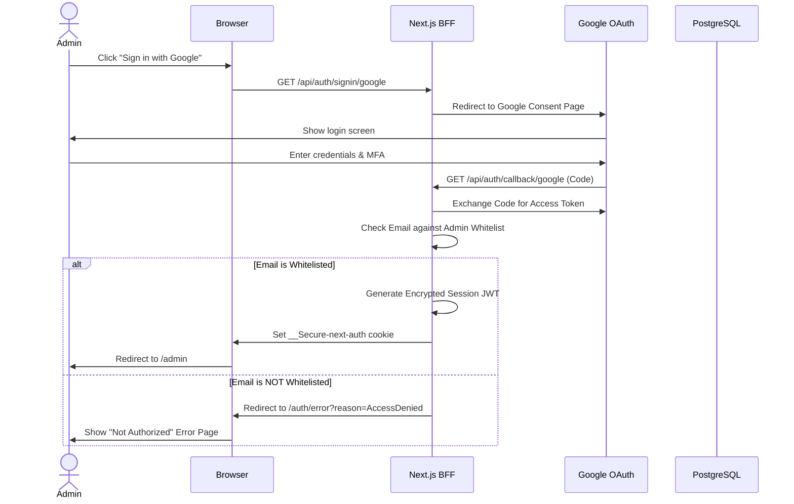
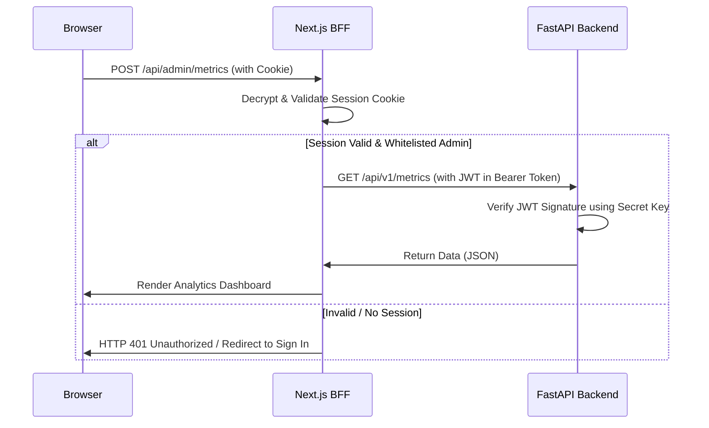

# 02.3 — Authentication & Authorization | المصادقة والتفويض

> **Status:** ✅ Complete — Ready for Review
> **Author:** Solo Developer + AI Architect
> **Date:** July 6, 2026
> **PRD Reference:** §6 Information Architecture, §8 Epic C & I, §10.7 Confidentiality
> **ADR References:** ADR-008

---

## Table of Contents

1. [Authentication Scope](#1-authentication-scope)
2. [Frontend Auth Architecture (NextAuth.js v5)](#2-frontend-auth-architecture-nextauthjs-v5)
3. [Provider Strategy](#3-provider-strategy)
4. [Session Management Strategy](#4-session-management-strategy)
5. [Role-Based Access Control (RBAC)](#5-role-based-access-control-rbac)
6. [Cross-Service Auth (Next.js ◄─► FastAPI)](#6-cross-service-auth-nextjs-─►-fastapi)
7. [Unauthenticated Rate Limiting & Identity](#7-unauthenticated-rate-limiting--identity)
8. [Session Lifecycle & Security Headers](#8-session-lifecycle--security-headers)
9. [Authentication Flows](#9-authentication-flows)

---

## 1. Authentication Scope

الموقع العام لـ bashar.ai هو **موقع عام مفتوح بالكامل (Public-facing)** لا يتطلب تسجيل دخول لمعظم الزوار لقراءة خبرة العمل، المشاريع، والمدونة.

ينحصر نطاق المصادقة والتفويض في الحالات التالية:
1. **لوحة التحكم للمسؤول (`/admin`)**: لإدارة محتوى الموقع، مشاهدة إحصائيات الاستخدام والتحليلات، ومراجعة تقييمات الـRAG.
2. **تحديد هوية المستخدمين لـ RAG (بشكل غير مرئي)**: للحد من استغلال الخدمة (Rate Limiting) وتتبع المحادثات دون إجبار المستخدمين على تسجيل الدخول.

---

## 2. Frontend Auth Architecture (NextAuth.js v5)

تم اختيار **NextAuth.js v5 (المعروف بـ Auth.js)** ليكون المحرك الأساسي للمصادقة في الواجهة الأمامية.

### المزايا المعمارية لـ NextAuth.js v5:
- **دعم كامل للـ App Router:** يعمل بكفاءة مع React Server Components (RSC) وMiddleware.
- **تأمين الجلسات عند الحافة (Edge-ready):** يمكن تشغيل الـ middleware الخاص به على Edge PoPs مباشرة لتسريع عمليات التحقق من الجلسات.
- **إدارة الجلسات بشكل مبسط:** يتعامل مع ملفات تعريف الارتباط المؤمنة (Secure Cookies) ويوفر حماية مدمجة ضد هجمات CSRF.

---

## 3. Provider Strategy

لحماية لوحة المسؤول وتبسيط الوصول، نستخدم مزودي الخدمة التاليين:

| Provider | Enabled For | Purpose | Rationale |
|----------|-------------|---------|-----------|
| **Google OAuth 2.0** | Admin Only | Primary Admin Login | Secure, multi-factor authentication (MFA) handled by Google. |
| **GitHub OAuth 2.0** | Admin Only | Backup Admin Login | Direct integration with the developer's main portfolio evidence source. |
| **Passwordless (Magic Link)** | Admin Only | Emergency access | Email-based login token using SMTP (Resend/SendGrid) as a fallback. |

> [!WARNING]
> **قيد الأمان الصارم:**
> يتم التحقق من البريد الإلكتروني للمستخدم المسجل (e.g. `owner@bashar.ai`) مقابل قائمة بيضاء (Whitelist) في متغيرات البيئة. يُمنع أي مستخدم آخر من تسجيل الدخول أو الوصول إلى `/admin` حتى لو نجحت مصادقة Google/GitHub الخاصة به.

---

## 4. Session Management Strategy

### القرار: استخدام جلسات الـ JWT (JSON Web Tokens) المشفرة بالكامل.

| Strategy | Pros | Cons | Selection Rationale |
|----------|------|------|---------------------|
| **Database Sessions** | • Instant revocation possible<br>• Easy tracking of active sessions | • Adds database query overhead on every server-rendered page<br>• Harder to scale horizontally | Rejected: Unnecessary overhead for a single-admin application. |
| **JWT Sessions** ✅ | • Stateless, zero database calls during page renders<br>• Extremely fast validation | • Harder to instantly revoke before expiration | **Chosen:** NextAuth.js handles encryption natively using AES-GCM (JWE). Performance is key for GCC user experience. |

### JWT Encryption Details:
- يتم تشفير الـ JWE بالكامل باستخدام مفتاح سري قوي (`NEXTAUTH_SECRET`) يتم تدويره دورياً.
- تُحفظ الجلسة في ملف تعريف ارتباط محمي بخصائص: `HttpOnly`, `Secure`, `SameSite=Lax`.

---

## 5. Role-Based Access Control (RBAC)

يمتلك النظام دورين (Roles) فقط لتقليل التعقيد:

| Role | Access Permissions | Authentication |
|------|--------------------|----------------|
| **Public User** | Read case studies, blog posts, use RAG assistant (rate-limited). | None required |
| **Administrator** | Full access to `/admin`, modify MDX content metadata, view observability dashboards, run manual evaluation sets. | Authenticated (Google/GitHub/Magic Link) |

### Next.js Middleware Route Protection:
```typescript
// middleware.ts
import { auth } from "@/lib/auth"

export default auth((req) => {
  const isLoggedIn = !!req.auth
  const isOnAdmin = req.nextUrl.pathname.startsWith("/admin")

  if (isOnAdmin && !isLoggedIn) {
    return Response.redirect(new URL("/api/auth/signin", req.nextUrl))
  }
})
```

---

## 6. Cross-Service Auth (Next.js ◄─► FastAPI)

عندما تتصل الواجهة الأمامية (Next.js) بالـ API الخاص بـ FastAPI لطلب الـ RAG أو جلب تحليلات لوحة التحكم، يجب تأمين هذا الاتصال.

```
[Browser] ──► [Next.js BFF] ──(NextAuth JWT check)──► [FastAPI Backend]
                    │                                        ▲
                    └─────── (Bearer Auth: API KEY) ─────────┘
```

1. **اتصالات المسؤول (Admin Endpoints):**
   - تقوم Next.js بتضمين الـ JWT المشفر في رأس الطلب كـ `Authorization: Bearer <JWT>`.
   - يقوم FastAPI بفك تشفير الـ JWT والتحقق منه باستخدام نفس الـ `NEXTAUTH_SECRET` المشترك للتحقق من هوية المسؤول وصلاحياته.

2. **اتصالات الزوار العامة (Public RAG API):**
   - للاتصال بـ FastAPI لطلب إجابات RAG، تمر الطلبات عبر Next.js API Routes كـ **Proxy (BFF)**.
   - يتصل Next.js بالـ FastAPI باستخدام مفتاح واجهة برمجة تطبيقات داخلي آمن (`INTERNAL_API_KEY`) كـ `X-Internal-Key: <SECRET_KEY>` لمنع أي وصول خارجي مباشر إلى FastAPI RAG Engine.

---

## 7. Unauthenticated Rate Limiting & Identity

لمنع إساءة استخدام الـ RAG Assistant وتجنب تكاليف الاستهلاك المرتفعة مع الحفاظ على تجربة مستخدم خالية من الحواجز (No Auth Required):

1. **تحديد الهوية عبر البصمة (Fingerprinting & IP):**
   - يتم دمج عنوان الـ IP الخاص بالطلب مع البصمة التقنية للمتصفح (User-Agent + Headers) لإنشاء معرف فريد مشفر (SHA-256 hash).
   - يُخزن هذا المعرف في **Redis** كـ Key لعداد الطلبات.

2. **استراتيجية خزان الرموز (Token Bucket Rate Limiting):**
   - لكل زائر غير مسجل: **5 طلبات كحد أقصى في الساعة**.
   - يتم تحديث العداد تلقائياً باستخدام Redis TTL.
   - إذا تم تجاوز الحد، يتم إرجاع خطأ `HTTP 429 Too Many Requests` مع رسالة ثنائية اللغة عداد تنازلي للزائر.

---

## 8. Session Lifecycle & Security Headers

- **صلاحية الجلسة (Session Max Age):** 30 يوماً بشكل افتراضي.
- **تحديث الجلسة (Session Update):** يتم تحديث تاريخ انتهاء الجلسة تلقائياً إذا كان المستخدم نشطاً وتجاوز نصف مدة الصلاحية.
- **حماية ملفات تعريف الارتباط (Cookie Security):**
  ```
  __Secure-next-auth.session-token; HttpOnly; Secure; SameSite=Lax; Path=/
  ```

---

## 9. Authentication Flows

### 9.1 Admin Sign-in Flow (Google OAuth)



### 9.2 API Request Auth Verification Flow



---

*Last updated: July 6, 2026*
