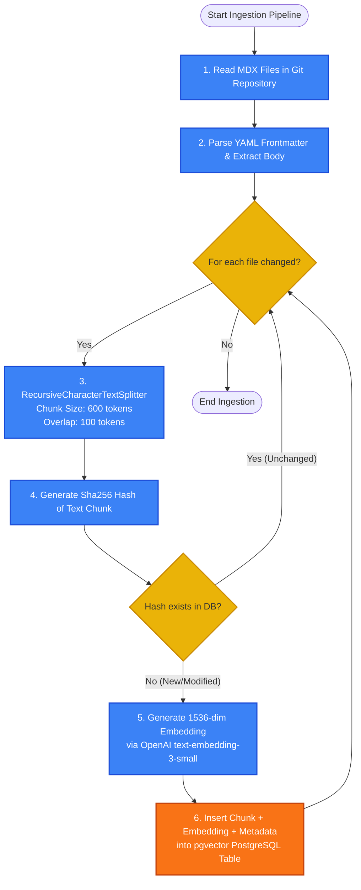
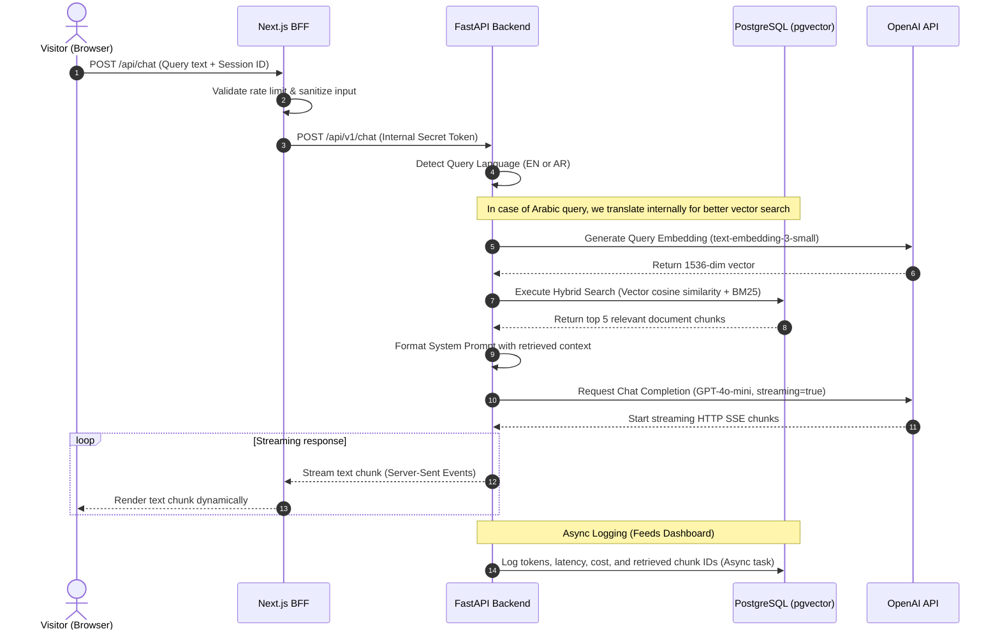

# 03.2 — RAG Flow | تدفق خط أنابيب RAG

> **Status:** ✅ Complete — Ready for Review
> **Author:** Solo Developer + AI Architect
> **Date:** July 6, 2026
> **PRD Reference:** §8 Epic E1 (Site AI Assistant) & Epic E2 (Observability Dashboard)
> **Architecture Reference:** 02.4 Internationalization, 02.5 RAG Architecture

---

## Table of Contents

1. [Introduction](#1-introduction)
2. [Ingestion Pipeline Flow](#2-ingestion-pipeline-flow)
3. [Query & Generation Flow (User Interaction)](#3-query--generation-flow-user-interaction)
4. [Hybrid Search & i18n Strategy](#4-hybrid-search--i18n-strategy)
5. [Evaluation Loop Flow](#5-evaluation-loop-flow)
6. [Exception & Fallback Flows](#6-exception--fallback-flows)

---

## 1. Introduction

يوضح هذا المستند **تدفق خط أنابيب RAG التفصيلي (RAG Flow)** لمساعد الموقع الذكي (Epic E1)، مبيناً كيفية تحويل الملفات النصية المصدريّة إلى تضمينات متجهية، ودورة حياة استعلام الزائر من لحظة كتابته للسؤال وحتى بث الإجابة النهائية باللغة المناسبة، بالإضافة لكيفية تشغيل حلقة التقييم التلقائي للأداء.

---

## 2. Ingestion Pipeline Flow

يتم تشغيل خط أنابيب معالجة البيانات (Ingestion) تلقائياً أثناء عملية البناء والنشر (Build phase) لتحديث قاعدة البيانات المتجهية عند تغيير المحتوى.



---

## 3. Query & Generation Flow (User Interaction)

يوضح مخطط التسلسل التالي كيف يتفاعل المستخدم مع المساعد الذكي، ومسار المعالجة غير المتزامنة للبث المباشر (Streaming):



---

## 4. Hybrid Search & i18n Strategy

لضمان دقة استرجاع البيانات الدلالية في بيئة ثنائية اللغة (عربي/إنجليزي):

1. **كشف اللغة والبحث الدلالي المتقاطع (Cross-lingual retrieval):**
   - عندما يبحث المستخدم بـ "ما هي خبرة العمل في أمازون؟" (عربي)، وتكون تفاصيل دراسة الحالة مكتوبة بـ "Worked as a Cloud Developer..." (إنجليزي).
   - يعتمد النموذج على التضمين اللغوي المتعدد (Multilingual properties) لنموذج OpenAI لربط دلالة المعاني بين اللغتين، مع تطبيق تصفية (Metadata filter) تعطي الأولوية للوثائق المكتوبة باللغة العربية أولاً، وإذا لم تتوفر، يتم الاسترجاع من الإنجليزية وترجمتها تلقائياً في سياق النموذج.

2. **التصفية والدمج (Reciprocal Rank Fusion - RRF):**
   - يتم تصفية وجمع نتائج البحث المتجهي (pgvector) والبحث النصي (BM25) لمنع إخفاق الكلمات المفتاحية الدقيقة.

---

## 5. Evaluation Loop Flow

تعتبر حلقة التقييم هي العمود الفقري لـ **Engineering Evidence** لإثبات خلو النظام من الهلوسة واستدامة أدائه.

```mermaid
flowchart TD
    %% Styling definitions
    classDef process fill:#10b981,stroke:#047857,stroke-width:2px,color:#fff;
    classDef check fill:#eab308,stroke:#ca8a04,stroke-width:2px,color:#333;
    classDef db fill:#f97316,stroke:#c2410c,stroke-width:2px,color:#fff;

    Start([Trigger Evaluation Run]) --> FetchSet[1. Fetch Golden Set QA Pairs from DB]:::process
    FetchSet --> LoopQA{For each QA pair?}:::check
    
    LoopQA -- Yes --> RunRAG[2. Run RAG Pipeline with Test Question]:::process
    LoopQA -- No --> CalculateAvg[6. Calculate Average Metrics & Pass Rate]:::process
    
    RunRAG --> GetOutput[3. Retrieve Generated Answer & Context Chunks]:::process
    
    GetOutput --> RunEvaluator[4. LLM-as-a-Judge Eval (GPT-4o)<br/>- Context Relevance<br/>- Groundedness<br/>- Answer Relevance]:::process
    
    RunEvaluator --> LogResult[5. Log individual score to DB]:::db
    LogResult --> LoopQA
    
    CalculateAvg --> WriteGlobal[7. Write Evaluation Run RunID to DB]:::db
    WriteGlobal --> EndEval([End Evaluation Run])
```

- **RAG Triad Metrics:**
  - **Context Relevance:** هل السياق المسترجع مفيد لسؤال المستخدم؟
  - **Groundedness:** هل الإجابة المولدة تعتمد بالكامل على السياق فقط ولا تخترع معلومات؟
  - **Answer Relevance:** هل الإجابة تجيب مباشرة وبدقة على سؤال المستخدم؟

---

## 6. Exception & Fallback Flows

توضح المصفوفة التالية استراتيجيات التعافي عند انقطاع أحد المكونات الحساسة:

```
[User Query] ──► [FastAPI API Gate]
                      │
                      ├──► [OpenAI API Offline?] ──► [Fallback to GPT-4o-mini or show bilingual error]
                      │
                      ├──► [PostgreSQL Offline?] ──► [Fallback to Redis cached context or show offline error]
                      │
                      └──► [Redis Offline?]      ──► [Bypass caching, execute DB query directly (slower)]
```

- **OpenAI Timeout:** في حال استغرق النموذج أكثر من **8 ثوانٍ** للرد، يتم قطع الاتصال تلقائياً وتنبيه المستخدم بلطف لإعادة المحاولة (Bilingual timeout message).
- **No relevant context:** إذا انخفضت نقاط التشابه الدلالي (Similarity Score) لجميع القطع المسترجعة عن **0.65**، يتم استدعاء موجه مخصص يمنع النموذج من التخمين ويكتفي برسالة توجيهية واضحة للحدود المعرفية للمساعد.

---

*Last updated: July 6, 2026*
