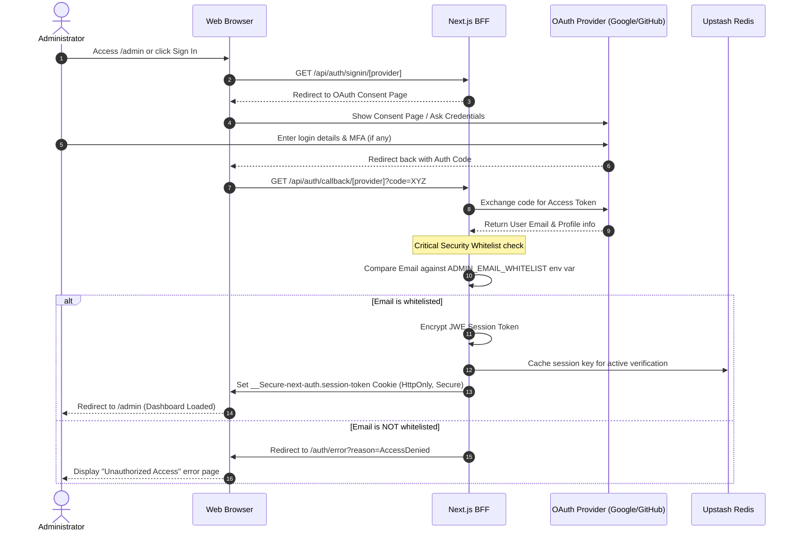
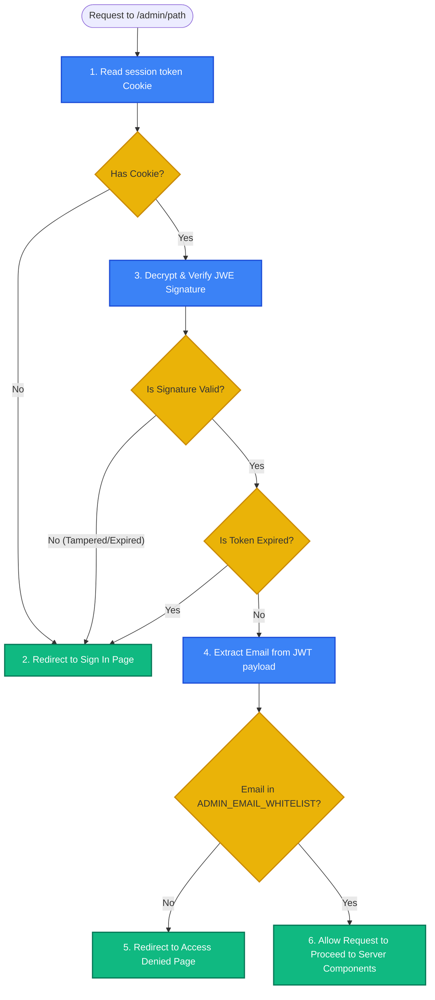
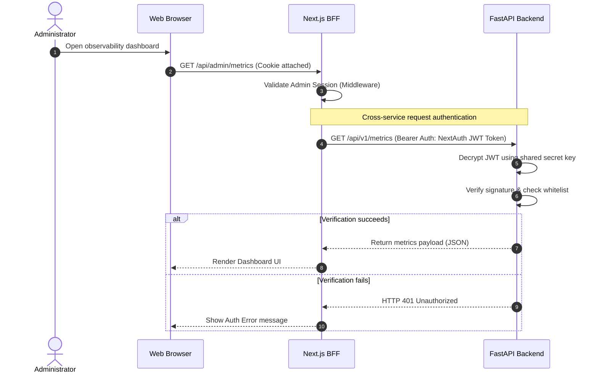
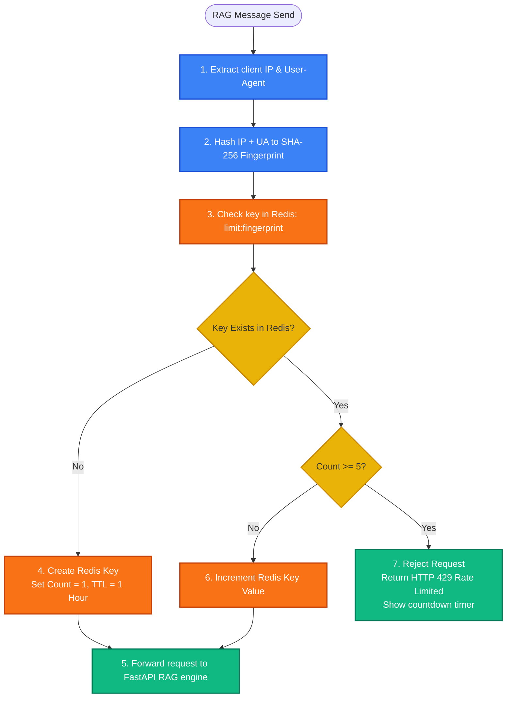

# 03.3 — Authentication Flow | تدفق عمليات المصادقة والتحقق

> **Status:** ✅ Complete — Ready for Review
> **Author:** Solo Developer + AI Architect
> **Date:** July 6, 2026
> **PRD Reference:** §6 Information Architecture, §8 Epic C & I
> **Architecture Reference:** 02.3 Authentication

---

## Table of Contents

1. [Introduction](#1-introduction)
2. [OAuth Sign-in & Whitelist Verification Flow](#2-oauth-sign-in--whitelist-verification-flow)
3. [Admin Route Protection Middleware Flow](#3-admin-route-protection-middleware-flow)
4. [Cross-Service API Authorization (BFF to FastAPI)](#4-cross-service-api-authorization-bff-to-fastapi)
5. [Unauthenticated Rate Limiting Flow](#5-unauthenticated-rate-limiting-flow)

---

## 1. Introduction

يقدم هذا المستند **تدفقات عمليات المصادقة والتحقق بالتفصيل (Authentication Flow)**، مبيناً مسارات تسجيل الدخول للمسؤولين وحماية المسارات المغلقة، وآلية المصادقة والتحقق ثنائية الخدمات بين خوادم Next.js و FastAPI، وكيفية تصفية طلبات الزوار للحد من الاستهلاك (Rate Limiting).

---

## 2. OAuth Sign-in & Whitelist Verification Flow

يصف مخطط التسلسل التالي مسار تسجيل دخول المسؤول باستخدام Google أو GitHub والتحقق الإجباري من القائمة البيضاء (Whitelist) لمنع دخول الغرباء:

---

## 3. Admin Route Protection Middleware Flow

تجري هذه العملية فوراً في طبقة Edge Middleware مع كل طلب وصول لـ `/admin` للتحقق من الجلسة في زمن استجابة سريع للغاية:

---

## 4. Cross-Service API Authorization (BFF to FastAPI)

عندما يطلب المسؤول المسجل بيانات سرية (مثل تحليلات الرسوم البيانية أو اختبارات التقييم) من خادم FastAPI، تتم المصادقة عبر رأس الـ Authorization:

---

## 5. Unauthenticated Rate Limiting Flow

لحماية مساعد الـ RAG المجاني من سوء الاستخدام مع الحفاظ على سهولة الوصول للزوار:

---

*Last updated: July 6, 2026*
