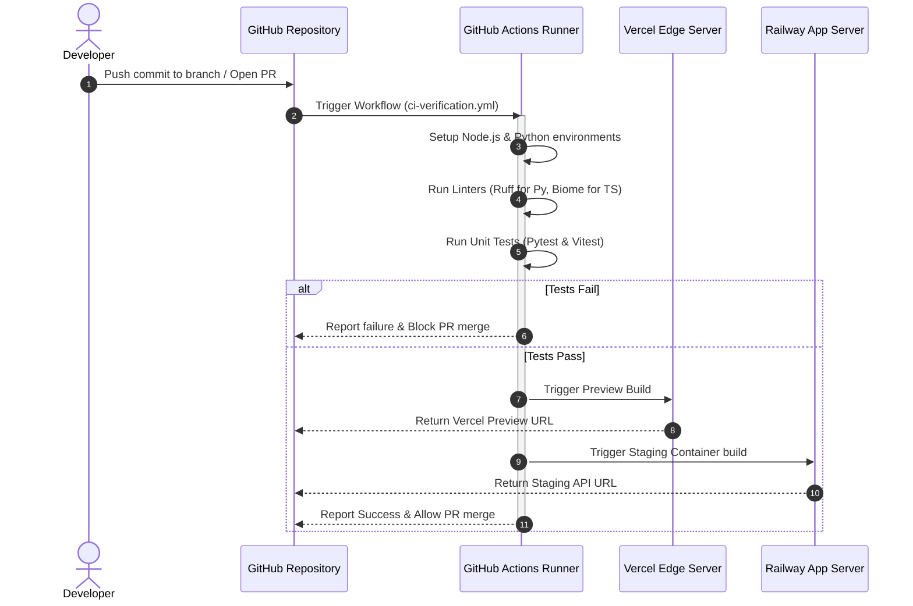
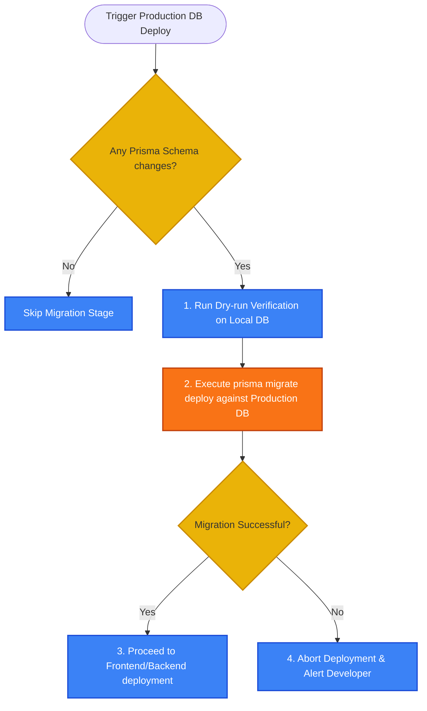

# 03.4 — Deployment Flow | تدفق عمليات النشر والـ CI/CD

> **Status:** ✅ Complete — Ready for Review
> **Author:** Solo Developer + AI Architect
> **Date:** July 6, 2026
> **PRD Reference:** §12 Roadmap & Milestones, §10 Non-Functional Requirements (Uptime & Ops)
> **Architecture Reference:** 02.2 Infrastructure, 02.10 Configuration Management

---

## Table of Contents

1. [Introduction](#1-introduction)
2. [CI/CD Pipeline Flow (Overview)](#2-cicd-pipeline-flow-overview)
3. [Continuous Integration (PR Verification Stage)](#3-continuous-integration-pr-verification-stage)
4. [Continuous Deployment (Production Promotion Stage)](#4-continuous-deployment-production-promotion-stage)
5. [Database Migrations Deployment Flow](#5-database-migrations-deployment-flow)
6. [Rollback Sequence](#6-rollback-sequence)

---

## 1. Introduction

يوضح هذا المستند **آلية تدفق عمليات النشر والتكامل المستمر (Deployment & CI/CD Flow)** لمنصة bashar.ai، مفصلاً مسار الكود البرمجي من لحظة دفعه (Push) إلى مستودع GitHub وحتى بنائه واختباره وتوزيعه آلياً على بيئات الإنتاج على Vercel و Railway مع إدارة ترقية الجداول وتعديلاتها البرمجية دون انقطاع للخدمة.

---

## 2. CI/CD Pipeline Flow (Overview)

تم تصميم خط النشر ليكون مؤتماً بالكامل لتقليل الأخطاء البشرية وضمان جودة الكود المصدري للمطور المنفرد:

```mermaid
graph TD
    %% Styling definitions
    classDef git fill:#f3f4f6,stroke:#374151,stroke-width:2px;
    classDef ci fill:#3b82f6,stroke:#1d4ed8,stroke-width:2px,color:#fff;
    classDef cd fill:#10b981,stroke:#047857,stroke-width:2px,color:#fff;
    classDef db fill:#f97316,stroke:#c2410c,stroke-width:2px,color:#fff;

    Start([1. Push Code / Open PR in GitHub]):::git --> LintStage[2. CI Pipeline Triggered<br/>Linting & Formatting Check]:::ci
    
    LintStage --> TestStage[3. Run Automated Unit Tests<br/>(Pytest & Vitest)]:::ci
    TestStage --> BuildStage[4. Verify App Builds<br/>Next.js Build Check]:::ci
    
    BuildStage --> PRMerge{Is Pull Request Merged to master?}:::ci
    
    PRMerge -- No (PR Preview) --> DeployPreview[5. Deploy Preview Environments<br/>Vercel Previews + Railway Staging]:::cd
    PRMerge -- Yes (Production) --> Migrations[6. Run Database Migrations<br/>Prisma Migrate Deploy]:::db
    
    Migrations --> DeployProd[7. Deploy Production Containers<br/>Vercel Production + Railway Production]:::cd
    DeployProd --> PostDeploy[8. Post-deploy Health Check & CDN Purge]:::cd
    PostDeploy --> End([Deployment Success])
```

---

## 3. Continuous Integration (PR Verification Stage)

تجري هذه المرحلة آلياً عبر **GitHub Actions** عند كل عملية رفع كود أو فتح طلب دمج (Pull Request) للتحقق من سلامة الأكواد قبل دمجها:



---

## 4. Continuous Deployment (Production Promotion Stage)

عند دمج التعديلات في الفرع الرئيسي (`master` / `main`)، يبدأ تدفق النشر الفعلي والترقية للإنتاج:

1. **Prisma Schema Update:**
   - يتم التحقق من وجود تعديلات في ملف `schema.prisma`.
   - يتم تشغيل أداة الترقية مباشرة ضد قاعدة بيانات Supabase/Neon الحية (Production DB) كخطوة سابقة لأي تحديث خوادم.
2. **FastAPI Container Build:**
   - يقوم Railway ببناء حاوية Docker جديدة للـ Backend وبمجرد نجاح الفحص الصحي (Health Check) الأولي للحاوية الجديدة، يتم توجيه حركة المرور إليها (Zero Downtime Deploy).
3. **Next.js Production Build:**
   - يقوم Vercel ببناء صفحات الـ Next.js الثابتة وتحديث التوجيه في شبكة CDN العالمية.

---

## 5. Database Migrations Deployment Flow

لتفادي فقدان البيانات أو تعطل قاعدة البيانات الحية أثناء تعديل الجداول:



*ملاحظة أمنية:* يتم قفل قاعدة البيانات (DB lock) مؤقتاً وبشكل تلقائي أثناء عمليات الترحيل لتجنب حدوث Race Conditions وتضارب البيانات.

---

## 6. Rollback Sequence

في حال حدوث خلل أو فشل مفاجئ في بيئة الإنتاج بعد النشر:

- **الواجهة الأمامية (Vercel Rollback):**
  - نستخدم خاصية **Instant Rollback** المتوفرة في Vercel لإعادة حركة المرور للإصدار المستقر السابق بضغطة زر واحدة ودون الحاجة لإعادة بناء الكود (يستغرق < 2 ثانية).
- **الواجهة الخلفية (Railway Container Rollback):**
  - يتم إعادة تشغيل حاوية Docker السابقة (Previous Docker Image) فورياً عبر واجهة Railway.
- **قاعدة البيانات (DB Migration Rollback):**
  - في حال فشلت عملية ترحيل الجداول، يتم استعادة آخر نسخة احتياطية تلقائية (Automated snapshot) لقاعدة البيانات من Supabase/Neon وإيقاف النشر.

---

*Last updated: July 6, 2026*
