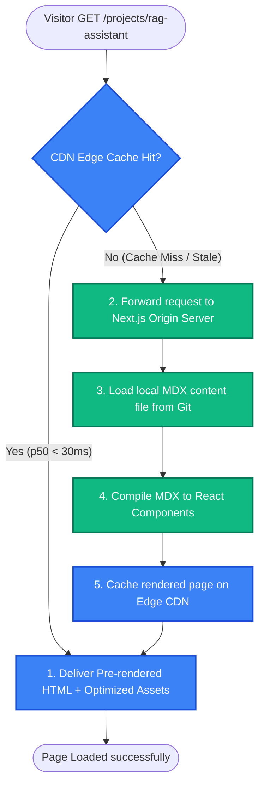
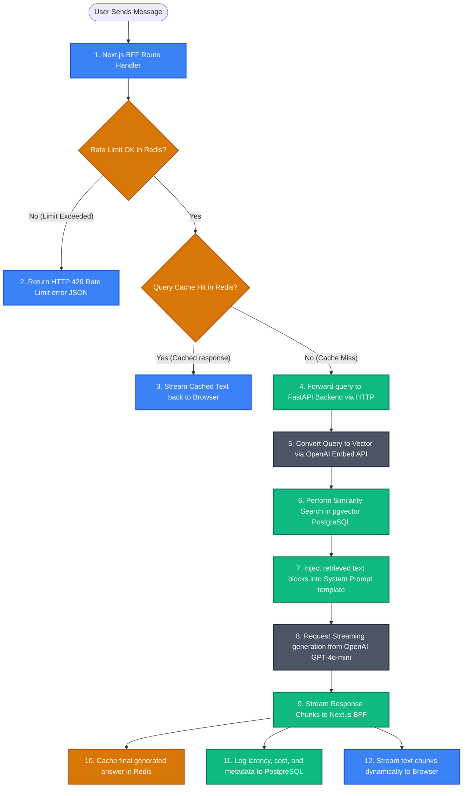
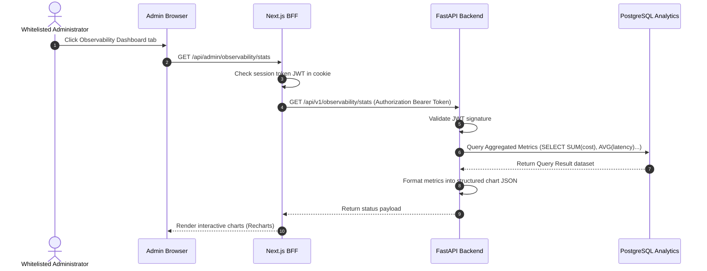

# 03.5 — Data Flow | تدفق البيانات عبر النظام

> **Status:** ✅ Complete — Ready for Review
> **Author:** Solo Developer + AI Architect
> **Date:** July 6, 2026
> **PRD Reference:** §6 Information Architecture, §8 Epic E1 & E2
> **Architecture Reference:** 02.8 Performance, 02.9 Error Handling

---

## Table of Contents

1. [Introduction](#1-introduction)
2. [Content Request Data Flow (CDN Caching)](#2-content-request-data-flow-cdn-caching)
3. [RAG Query Data Flow (AI Assistant Chat)](#3-rag-query-data-flow-ai-assistant-chat)
4. [Admin Observatory Query Data Flow (Dashboard Analytics)](#4-admin-observatory-query-data-flow-dashboard-analytics)
5. [Error & Fallback Data Flows](#5-error--fallback-data-flows)

---

## 1. Introduction

يقدم هذا المستند **تدفق البيانات التفصيلي عبر مكونات النظام (Data Flow)**، موضحاً كيفية تحرك طلبات البيانات والاستجابات بين واجهات المستخدم الأمامية وبوابات الـ APIs وقواعد البيانات وخوادم الكاش والذكاء الاصطناعي مع توضيح الفوارق بين حالات وجود البيانات في الذاكرة المؤقتة (Cache Hit) أو تعذر وجودها (Cache Miss).

---

## 2. Content Request Data Flow (CDN Caching)

يصف المخطط التالي تدفق طلب زائر لصفحة دراسة حالة مشروع أو مقال مدونة (ثابتة):

---

## 3. RAG Query Data Flow (AI Assistant Chat)

هذا هو التدفق الديناميكي الأهم للذكاء الاصطناعي، ويوضح حماية الطلب بالكاش والتقييد قبل تشغيل خوارزميات الـ RAG:

---

## 4. Admin Observatory Query Data Flow (Dashboard Analytics)

يصف المخطط التالي كيفية سحب وعرض بيانات المراقبة والتحليل للمسؤول:

---

## 5. Error & Fallback Data Flows

في حال فشل الوصول لقاعدة البيانات أو تعذر الاتصال بـ Redis:

- **Redis Offline (Rate Limiter Fallback):**
  - عند فشل الاتصال بـ Redis، يتم تمرير طلب المستخدم وتخطي خطوة الـ Rate limit مؤقتاً (Fail-Open) لضمان عدم حجب الزوار الحقيقيين، مع تسجيل تحذير `WARNING` في السجلات لإصلاح الخادم.
- **Database Connection Failure:**
  - إذا تعذر الاتصال بقاعدة البيانات أثناء محاولة البحث المتجهي RAG، يتراجع خادم FastAPI لإرسال السؤال مباشرة إلى OpenAI كـ **محادثة عامة ومجردة (Vanilla LLM Chat)** مع إلحاق تنبيه يعتذر للمستخدم عن عدم القدرة على البحث في الوثائق الدقيقة حالياً.

---

*Last updated: July 6, 2026*
