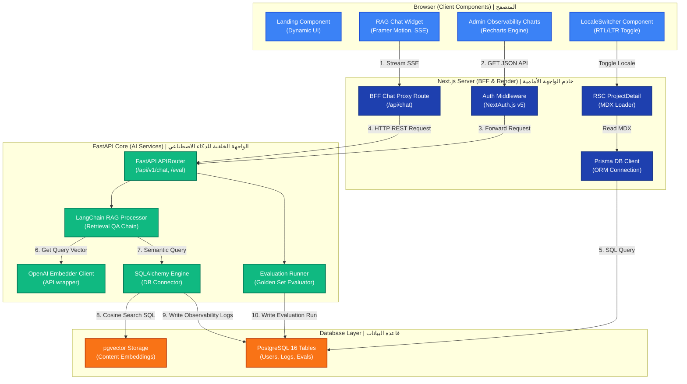

# 03.6 — Component Diagram | تفاعل مكونات النظام

> **Status:** ✅ Complete — Ready for Review
> **Author:** Solo Developer + AI Architect
> **Date:** July 6, 2026
> **PRD Reference:** §6 Information Architecture, §8 Functional Requirements
> **Architecture Reference:** 02.1 Technology Stack, 02.6 Logging & Monitoring

---

## Table of Contents

1. [Introduction](#1-introduction)
2. [Unified Component Interaction Map](#2-unified-component-interaction-map)
3. [Frontend Components (Next.js Application)](#3-frontend-components-nextjs-application)
4. [Backend Components (FastAPI Application)](#4-backend-components-fastapi-application)
5. [Interface Protocols & Data Binding](#5-interface-protocols--data-binding)

---

## 1. Introduction

يقدم هذا المستند **مخطط تفاعل المكونات بالتفصيل (Component Diagram)**، موضحاً الحدود البرمجية الفاصلة بين مكونات الواجهة الأمامية التي تعمل في المتصفح أو خادم Next.js (RSC/Client boundary) ومكونات البرمجيات والخدمات في الواجهة الخلفية FastAPI، وكيفية ترابطها برمجياً لتقديم تجربة تصفح متكاملة ومؤمنة.

---

## 2. Unified Component Interaction Map

يوضح المخطط الشامل التالي تفاعلات المكونات البرمجية الداخلية:

---

## 3. Frontend Components (Next.js Application)

يتبع تطبيق Next.js معايير تقسيم المكونات بناءً على متطلبات التشغيل (Server vs Client Components):

### 3.1 Server Components (RSC - Server-side rendering):
- **Project Detail Page (`/[locale]/projects/[slug]/page.tsx`):**
  - مكون خادم ثابت (Static RSC). يقرأ ملف الـ MDX المقابل لرمز المشروع ويقوم بتصييره إلى HTML ثابت في وقت البناء مع تحميل بيانات الـ metadata. يمنع هذا المكون إرسال كود معالجة Markdown الثقيل لمتصفح العميل.
- **Resume Page (`/[locale]/resume/page.tsx`):**
  - RSC يقرأ السيرة الذاتية ثنائية اللغة ويقدمها كـ HTML ثابت محسن لمحركات البحث (SEO) مع زر لتحميل ملف الـ PDF.

### 3.2 Client Components (Client-side interactivity):
- **Chat Widget (`/components/chat/ChatWidget.tsx`):**
  - مكون تفاعلي نشط ("use client"). يتعامل مع حالة المحادثة وتخزين الرسائل مؤقتاً في ذاكرة المتصفح المؤقتة (Session Storage) وبث نصوص الإجابة باستخدام SSE.
- **Observability Charts (`/components/admin/ObservabilityCharts.tsx`):**
  - مكون خاص بالمسؤول فقط ("use client"). يستورد محرك الرسوم البيانية Recharts ديناميكياً لتوليد رسوم تفاعلية متحركة لمراقبة الأداء والتكلفة دون إبطاء وقت التحميل الأول للموقع.

---

## 4. Backend Components (FastAPI Application)

تنقسم الواجهة الخلفية إلى وحدات برمجية (Modules) منفصلة المسؤولية:

- **APIRouter (`app/api/v1/`):**
  - طبقة التوجيه الأساسية، وتتضمن منافذ استقبال أسئلة الـ RAG، وطلبات تحليلات المسؤول، وبدء عمليات التقييم التلقائي.
- **RAG Orchestrator (`app/services/rag/`):**
  - ينظم مسار الـ RAG ويقوم بربط محرك التضمين، وقاعدة البيانات المتجهية، والموجه البرمجي (System Prompt) لتوليد إجابات دقيقة بناءً على السياق المسترجع.
- **Evaluation Runner (`app/services/eval/`):**
  - المكون المسؤول عن سحب الأسئلة الذهبية، استدعاء الـ RAG، وحساب مقاييس RAG Triad باستخدام نموذج التقييم (GPT-4o) وكتابتها في جداول التحليلات.

---

## 5. Interface Protocols & Data Binding

يتم تبادل البيانات والمحاذاة بين المكونات الأمامية والخلفية بالآليات التالية:

1. **Next.js BFF BFF Proxy:**
   - يعمل كطبقة تغليف (Wrapper) لمنع المتصفح من الاتصال المباشر بخادم FastAPI، مما يمنع تسرب الـ API Keys أو الروابط الداخلية ويسمح بتعديل مسارات الواجهة الخلفية دون تغيير كود المتصفح.
2. **Schema Synchronization:**
   - نستخدم نفس تصاميم هياكل البيانات برمجياً عبر مشاركة نماذج **Zod** في Next.js ونماذج **Pydantic** المقابلة لها في FastAPI لضمان سلامة البيانات قبل نقلها بين المكونات.

---

*Last updated: July 6, 2026*
