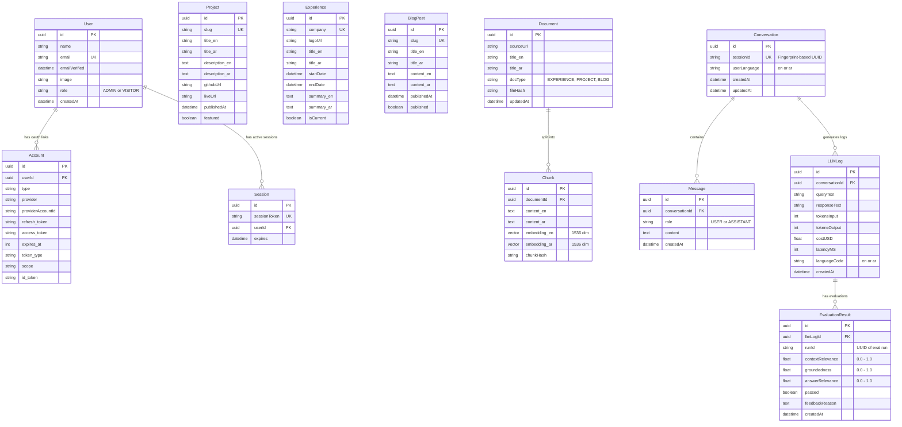

# 04.1 — Entity Relationship Diagram | مخطط العلاقات بين الكيانات (ERD)

> **Status:** ✅ Complete — Ready for Review
> **Author:** Solo Developer + AI Architect
> **Date:** July 6, 2026
> **PRD Reference:** §6 Information Architecture, §8 Functional Requirements
> **Architecture Reference:** 02.1 Technology Stack, 02.3 Authentication, 02.5 RAG, 02.6 Observability

---

## Table of Contents

1. [Database Entities Overview](#1-database-entities-overview)
2. [ERD Visual Diagram (Mermaid)](#2-erd-visual-diagram-mermaid)
3. [Relationships Mapping](#3-relationships-mapping)
4. [Domain-Specific Design Details](#4-domain-specific-design-details)

---

## 1. Database Entities Overview

تم تصميم هيكل قاعدة البيانات ليدمج بسلاسة بين أربعة مجالات بيانات رئيسية (Domains):
1. **المصادقة والمستخدمين (Auth Domain):** يطابق متطلبات NextAuth.js v5 لإدارة حسابات المسؤولين وجلساتهم.
2. **المحتوى والحقيبة المهنية (Content Domain):** يدير معلومات المشاريع الشخصية وخبرات العمل (NDA-safe) ومقالات المدونة ثنائية اللغة.
3. **مساعد الـ RAG (AI/RAG Domain):** يدير مستندات الـ Source والقطع المقسمة (Chunks) ومتجهاتها (Vectors) وسجل المحادثات.
4. **المراقبة والتقييم (Observability & Eval Domain):** يسجل إحصائيات الاستهلاك والتقييم التلقائي (RAG Triad) لتغذية لوحة المراقبة (Epic E2).

---

## 2. ERD Visual Diagram (Mermaid)

يوضح المخطط التالي جداول قاعدة البيانات والحقول الأساسية والعلاقات بين الكيانات:

---

## 3. Relationships Mapping | العلاقات والروابط

| Source Table | Target Table | Cardinality | Purpose |
|--------------|--------------|-------------|---------|
| **User** | **Account** | 1 to Many (1..*) | Google/GitHub OAuth profile links for the administrator. |
| **User** | **Session** | 1 to Many (1..*) | Active browser session tracking for NextAuth.js security checks. |
| **Document** | **Chunk** | 1 to Many (1..*) | MDX content documents split into smaller overlapping segments for RAG. |
| **Conversation** | **Message** | 1 to Many (1..*) | Interactive chat history logs between a visitor and the AI assistant. |
| **Conversation** | **LLMLog** | 1 to Many (1..*) | Request-level metrics logging for every individual query. |
| **LLMLog** | **EvaluationResult** | 1 to Many (1..*) | Automated metrics logging (RAG Triad) for LLM-as-a-judge outputs. |

---

## 4. Domain-Specific Design Details | تفاصيل التصميم للمجالات

### 4.1 التخزين المتجهي ثنائي اللغة (Bilingual Vector Storage):
- يحتوي جدول **Chunk** على حقلين متجهيين منفصلين: `embedding_en` و `embedding_ar` بنوع `vector(1536)`.
- **السبب:** هذا يتيح لنا تخزين وحساب متجهات اللغة الإنجليزية واللغة العربية بشكل مستقل ومثالي لكل قطعة نصية لتجنب خلط الكلمات وتحسين دقة البحث الدلالي.

### 4.2 تحديد الهوية الآمن (Unauthenticated Session Tracking):
- يربط جدول **Conversation** بجدول **Message** وجدول **LLMLog** عبر حقل `sessionId`.
- يُشتق `sessionId` برمجياً في خادم BFF بناءً على بصمة العميل (Client Fingerprint + SHA-256) دون تخزين أي بيانات شخصية (PII).

### 4.3 تتبع جودة الذكاء الاصطناعي (Evaluation Triad DB Schema):
- يرتبط جدول **EvaluationResult** بجدول **LLMLog** عبر مفتاح خارجي (Foreign Key).
- يسجل الجدول مقاييس الـ RAG Triad الثلاثية كقيم عشرية بين `0.0` و `1.0` لحساب المتوسطات وعرض اتجاه الأداء في لوحة المراقبة التفاعلية.

---

*Last updated: July 6, 2026*
