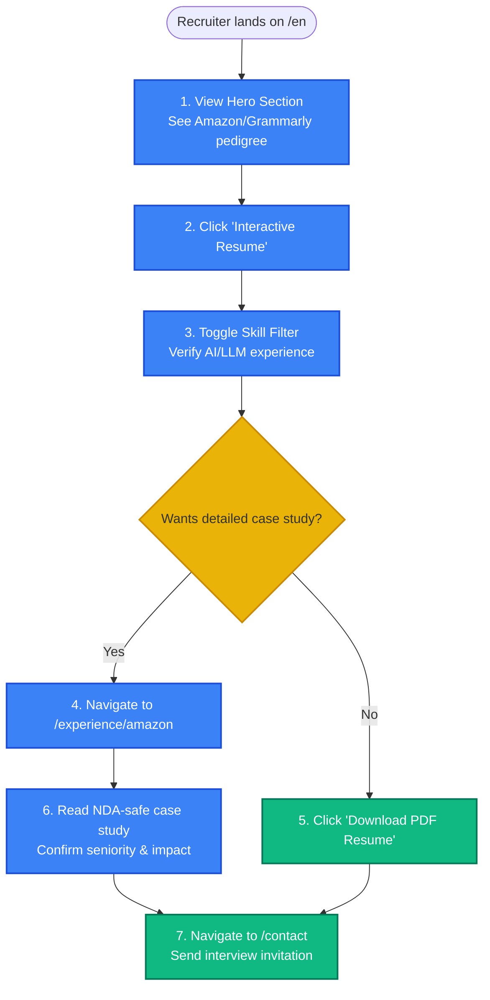
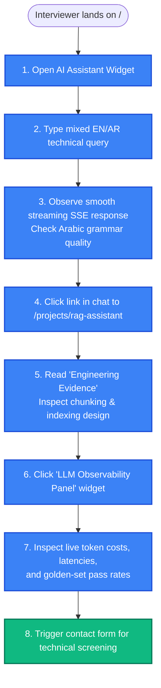
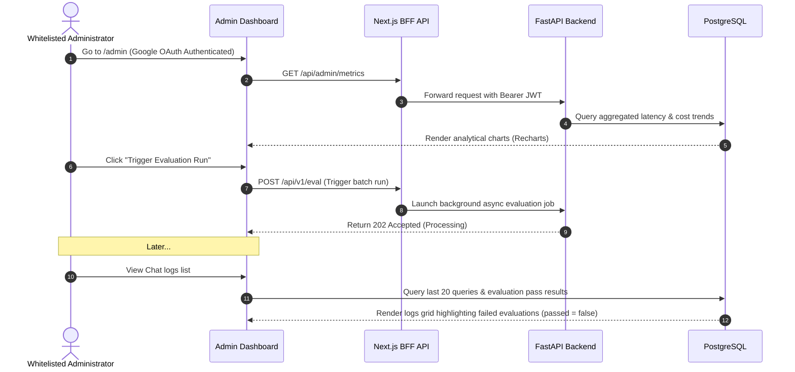

# 06.4 — User Flows | تدفقات ورحلة المستخدم

> **Status:** ✅ Complete — Ready for Review
> **Author:** Solo Developer + AI Architect
> **Date:** July 6, 2026
> **PRD Reference:** §3 User Personas, §8 Functional Requirements
> **Architecture Reference:** 02.3 Authentication, 02.5 RAG

---

## Table of Contents

1. [User Personas](#1-user-personas)
2. [Recruiter Journey (Pedigree to Engineering Evidence)](#2-recruiter-journey-pedigree-to-engineering-evidence)
3. [Technical Interviewer Journey (Assistant Evaluation)](#3-technical-interviewer-journey-assistant-evaluation)
4. [Administrator Journey (Observability & Ingestion)](#4-administrator-journey-observability--ingestion)

---

## 1. User Personas

يهدف تصميم رحلات المستخدمين إلى تلبية الاحتياجات الفريدة للجمهورين المستهدفين الأساسيين وفقاً لـ PRD §3:

1. **مدير التوظيف (Recruiter):** يبحث عن الأسماء اللامعة (Amazon/Grammarly) والتوثيق السريع السلس لإثبات الكفاءة (يملك وقت قراءة يقل عن 60 ثانية).
2. **المقيّم التقني (Technical Lead / Hiring Manager):** يبحث عن التفاصيل التقنية الدقيقة، جودة الكود، سجل القرارات والمقاييس البرمجية التي تثبت جدارة المرشح عملياً.

---

## 2. Recruiter Journey (Pedigree to Engineering Evidence)

توضح خريطة التدفق التالية رحلة مسؤول التوظيف من لحظة دخوله الموقع وحتى الوصول لوثيقة الخبرة وتأكيد الجدارة الفنية:

---

## 3. Technical Interviewer Journey (Assistant Evaluation)

يريد المقيّم التقني التحقق من أن مساعد الـ RAG الذكي ليس مجرد واجهة بسيطة بل تم هندسته وقياس أدائه بصرامة:

---

## 4. Administrator Journey (Observability & Ingestion)

يوضح مسار الإدارة للمسؤول لإجراء مهام الصيانة اليومية ومراجعة الجودة:

---

*Last updated: July 6, 2026*
