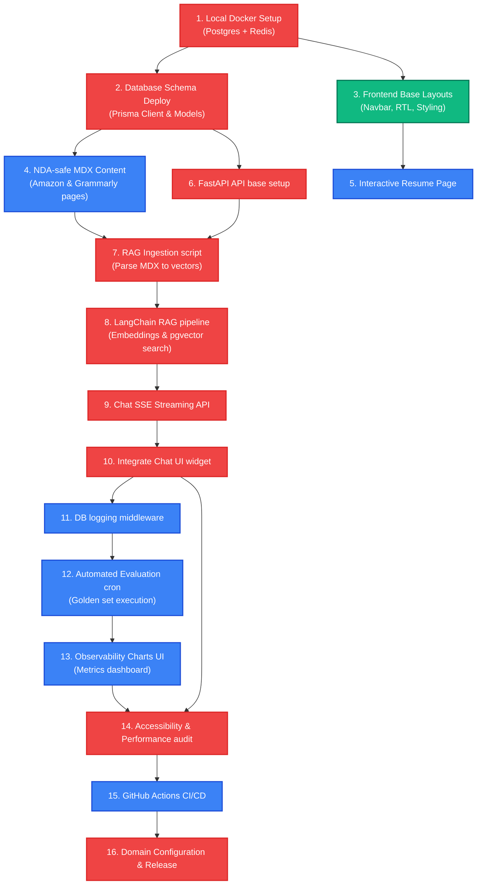

# 07.6 — Dependency Map | خريطة الاعتماديات والمسار الحرج للتطوير

> **Status:** ✅ Complete — Ready for Review
> **Author:** Solo Developer + AI Architect
> **Date:** July 6, 2026
> **PRD Reference:** §12 Roadmap & Milestones
> **Architecture Reference:** 02.1 Technology Stack, 02.2 Infrastructure

---

## Table of Contents

1. [Development Sequence Overview](#1-development-sequence-overview)
2. [Task Dependency Graph (Mermaid)](#2-task-dependency-graph-mermaid)
3. [Critical Path Analysis](#3-critical-path-analysis)
4. [Parallel Development Opportunities](#4-parallel-development-opportunities)

---

## 1. Development Sequence Overview

لتجنب حدوث فترات تعطل أو انسداد للمطور المنفرد أثناء العمل، قمنا بتحليل **خريطة الاعتماديات (Dependency Map)** وتحديد المهام التي تمثل حجر أساس للمراحل التالية، بالإضافة للمسار الحرج (Critical Path) الذي يتحكم في تاريخ إطلاق المنصة الحية.

---

## 2. Task Dependency Graph (Mermaid)

يوضح المخطط التالي ترابط المهام البرمجية والترتيب الصحيح للتنفيذ:



---

## 3. Critical Path Analysis | تحليل المسار الحرج

المسار الحرج (المعلم باللون الأحمر في الرسم) هو السلسلة الحاكمة لمعدل تقدم المشروع:

```
Docker Setup ──► Prisma Schema ──► FastAPI Setup ──► RAG Ingestion ──► RAG Pipeline ──► SSE Streaming ──► Chat Integration ──► UI/UX Hardening ──► Domain Deploy
```

*الأثر العملي:* أي تأخير في تطوير محرك RAG أو تشغيل الـ SSE Stream سيتسبب فوراً في تأخير تاريخ إطلاق المشروع، ولذلك يتم منح الأولوية القصوى لهذه المجموعات وتفادي تشتيتها بمهام التحسينات الجمالية الثانوية.

---

## 4. Parallel Development Opportunities | إمكانية العمل المتوازي

نظراً للعمل المنفرد بالتعاون مع المساعد الذكي، يمكن توجيه المساعد للعمل على مسارات متوازية لتسريع التطوير:

1. **الواجهة الأمامية والخبرات بالتوازي مع عمارة قاعدة البيانات (Front/DB Parallel):**
   - يمكن تصميم واجهات الـ CSS الثابتة وتخطيط الـ RTL (مسار 3) بالتوازي مع كتابة جداول Prisma (مسار 2) لعدم وجود اعتماد تزامني بينهما.
2. **شاشة المراقبة بالتوازي مع معالجة RAG (RAG/Charts Parallel):**
   - يمكن بناء وتصميم الرسوم البيانية التفاعلية للوحة التحكم (مسار 13) باستخدام بيانات وهمية (Mock Data) بالتوازي مع قيام المساعد ببرمجة محرك RAG وسجل التحليلات الفعلي (مسار 8)، مما يوفر ما يصل لـ 4 أيام تطويرية كاملة.

---

*Last updated: July 6, 2026*
