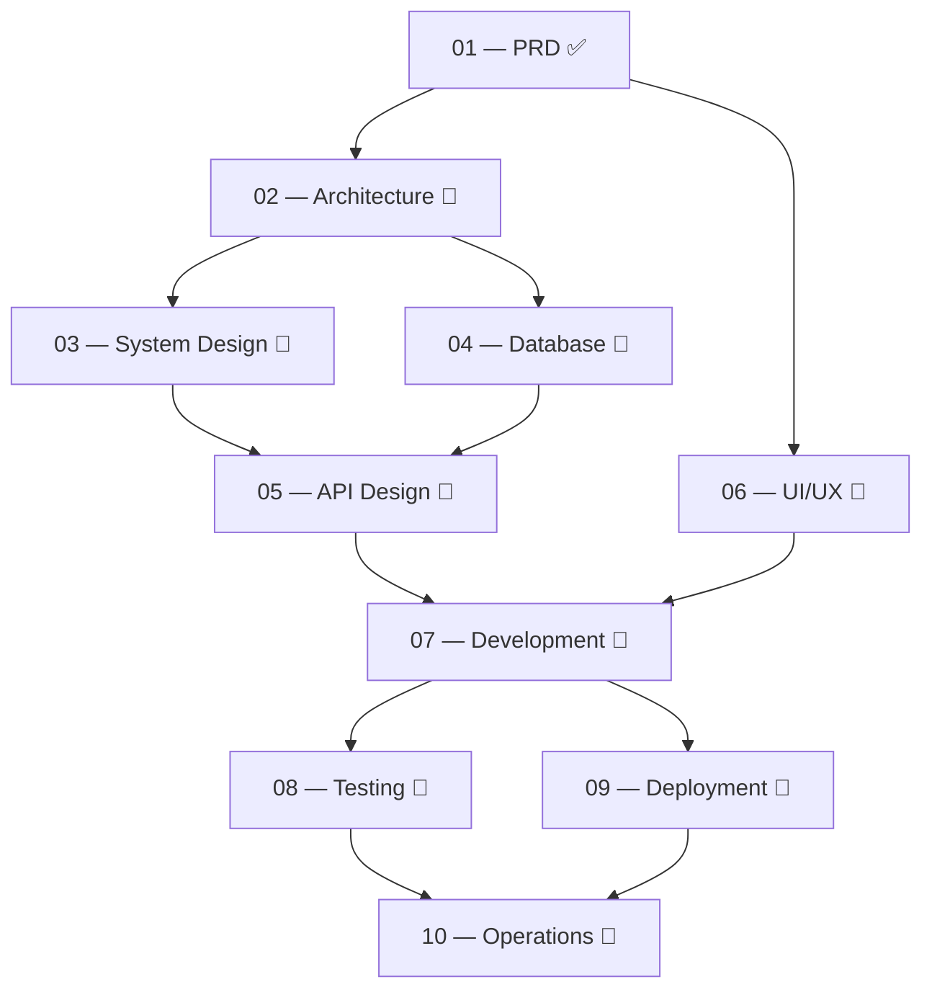

# 📚 basharai — Documentation Hub
## وثائق المشروع — الفهرس الرئيسي

> **Personal AI Engineering Platform — "Digital Headquarters"**
> منصة الهندسة الذكية الشخصية — "المقر الرقمي"

---

## Overview | نظرة عامة

This directory contains all project documentation for **basharai** — a Personal AI Engineering Platform designed to showcase the skills and experience of a mid-level LLM/AI Application Engineer with production experience at **Amazon** and **Grammarly**, targeting the **GCC market** (Saudi Arabia / UAE) as the primary audience.

هذا المجلد يحتوي على جميع وثائق مشروع **بشّر.ai** — منصة هندسة ذكاء اصطناعي شخصية مصممة لعرض مهارات وخبرات مهندس تطبيقات LLM/AI متوسط المستوى بخبرة إنتاجية حقيقية في **أمازون** و**جرامرلي**، تستهدف **سوق الخليج** (السعودية / الإمارات) كسوق أساسي.

---

## Documentation Phases | مراحل التوثيق

The documentation follows a **sequential, dependency-aware structure**. Each phase builds on the previous one. Work through them in order.

| # | Phase | الوصف | Status | Path |
|---|-------|-------|--------|------|
| 01 | [**PRD — Product Requirements**](./01-PRD/README.md) | ماذا نبني ولماذا؟ What are we building and why? | ✅ Complete | `docs/01-PRD/` |
| 02 | [**Architecture**](./02-Architecture/README.md) | كيف سنبنيه؟ How will we build it? | ✅ Complete | `docs/02-Architecture/` |
| 03 | [**System Design**](./03-System-Design/README.md) | ما هو شكل النظام؟ What does the system look like? | ✅ Complete | `docs/03-System-Design/` |
| 04 | [**Database**](./04-Database/README.md) | كيف ننظّم البيانات؟ How do we organize data? | ✅ Complete | `docs/04-Database/` |
| 05 | [**API Design**](./05-API/README.md) | ما هي نقاط الوصول؟ What are the endpoints? | ✅ Complete | `docs/05-API/` |
| 06 | [**UI/UX**](./06-UI-UX/README.md) | كيف ستبدو الواجهات؟ What will the interfaces look like? | ✅ Complete | `docs/06-UI-UX/` |
| 07 | [**Development**](./07-Development/README.md) | كيف ننظّم التطوير؟ How do we organize development? | 🔲 Not Started | `docs/07-Development/` |
| 08 | [**Testing**](./08-Testing/README.md) | كيف نضمن الجودة؟ How do we ensure quality? | 🔲 Not Started | `docs/08-Testing/` |
| 09 | [**Deployment**](./09-Deployment/README.md) | كيف ننشر المشروع؟ How do we deploy? | 🔲 Not Started | `docs/09-Deployment/` |
| 10 | [**Operations**](./10-Operations/README.md) | كيف نشغّل ونراقب؟ How do we operate and monitor? | 🔲 Not Started | `docs/10-Operations/` |

---

## Cross-cutting Documents | وثائق مشتركة

| Document | الوصف | Purpose |
|----------|-------|---------|
| [**GLOSSARY.md**](./GLOSSARY.md) | المصطلحات | Key terms and definitions used across all phases |
| [**DECISIONS.md**](./DECISIONS.md) | سجل القرارات | Architecture Decision Records (ADR) log |

---

## How to Navigate | كيف تتنقل بين الوثائق

```
basharai/
├── AI-Engineer-Platform-PRD-v2.md    ← 📄 The PRD lives at project root
│
└── docs/
    ├── README.md                     ← 📌 You are here (Master Index)
    ├── GLOSSARY.md                   ← 📖 Key terms & definitions
    ├── DECISIONS.md                  ← 📋 Architecture Decision Records
    │
    ├── 01-PRD/                       ← ✅ Product Requirements (Complete)
    │   └── README.md
    │
    ├── 02-Architecture/              ← 🔲 Architecture Document (10 sub-docs)
    │   └── README.md
    │
    ├── 03-System-Design/             ← 🔲 System Design & Diagrams (6 sub-docs)
    │   └── README.md
    │
    ├── 04-Database/                  ← 🔲 Database Design (5 sub-docs)
    │   └── README.md
    │
    ├── 05-API/                       ← 🔲 API Specification (8 sub-docs)
    │   └── README.md
    │
    ├── 06-UI-UX/                     ← 🔲 UI/UX Specification (8 sub-docs)
    │   └── README.md
    │
    ├── 07-Development/               ← 🔲 Development Plan (6 sub-docs)
    │   └── README.md
    │
    ├── 08-Testing/                   ← 🔲 Testing Strategy (7 sub-docs)
    │   └── README.md
    │
    ├── 09-Deployment/                ← 🔲 Deployment & CI/CD (6 sub-docs)
    │   └── README.md
    │
    └── 10-Operations/                ← 🔲 Operations & Monitoring (6 sub-docs)
        └── README.md
```

---

## Phase Dependencies | تبعيات المراحل



**القاعدة الذهبية:** لا تبدأ مرحلة جديدة قبل اكتمال المرحلة التي تعتمد عليها.
**Golden Rule:** Do not start a phase before its dependency phase is complete.

---

## Sub-document Inventory | جرد الوثائق الفرعية

| Phase | Expected Documents | Total |
|-------|-------------------|-------|
| 02 — Architecture | Technology Stack, Infrastructure, Auth, i18n, RAG, Logging, Security, Performance, Error Handling, Config | **10** |
| 03 — System Design | High-Level Architecture, RAG Flow, Auth Flow, Deployment Flow, Data Flow, Component Diagram | **6** |
| 04 — Database | ERD, Schema, Migrations, Seed Data, Vector Store | **5** |
| 05 — API | Overview, Auth Endpoints, Content Endpoints, AI Endpoints, Admin Endpoints, Error Codes, Rate Limiting, OpenAPI Spec | **8** |
| 06 — UI/UX | Design System, Page Inventory, Wireframes, User Flows, Responsive, RTL, Accessibility, Animations | **8** |
| 07 — Development | Epic Breakdown, Sprint Plan, Coding Standards, Git Strategy, Environment Setup, Dependency Map | **6** |
| 08 — Testing | Strategy, Unit, Integration, E2E, Performance, LLM Evaluation, Accessibility | **7** |
| 09 — Deployment | Strategy, CI/CD, Environment Config, Domain/DNS, SSL, Rollback | **6** |
| 10 — Operations | Monitoring, Alerting, Backup/Recovery, Incident Response, Cost Management, Runbooks | **6** |
| | | **Total: 62** |

---

## Key Project Parameters | معايير المشروع الأساسية

| Parameter | Value |
|-----------|-------|
| **Target Market** | GCC (Saudi Arabia / UAE) — confirmed priority |
| **Target Role** | LLM / AI Application Engineer (mid-level, 2–5 yrs) |
| **Languages** | English + Arabic (genuinely bilingual, not a translation layer) |
| **Candidate Profile** | Real production experience at Amazon and Grammarly |
| **Success Metric** | Interviews at 3–5 target companies within 6 months |
| **Content Pillars** | Professional Experience (NDA-safe) + Personal Flagship Projects + Technical Writing |
| **AI Features** | RAG Assistant + Eval/Observability Dashboard (depth over breadth) |

---

## Document Standards | معايير التوثيق

All documentation in this project follows these conventions:

1. **Bilingual Content** — Section headers in English, descriptions may include Arabic context where appropriate
2. **Status Tracking** — Each phase README tracks its own completion status
3. **Dependency Awareness** — Each phase explicitly lists what it depends on
4. **Sub-document Numbering** — Uses hierarchical numbering (e.g., `02.1`, `03.2`) for clear ordering
5. **Mermaid Diagrams** — Architecture and flow diagrams use Mermaid syntax for version-control-friendly visualization

---

## Getting Started | من أين تبدأ

1. ✅ **Read the PRD first** — [`AI-Engineer-Platform-PRD-v2.md`](../AI-Engineer-Platform-PRD-v2.md) at the project root
2. 🔜 **Next: Architecture** — Define the technology stack, infrastructure, and key architectural decisions
3. 🔜 **Then: System Design** — Create high-level diagrams and data flows
4. 🔜 **Then: Database** — Design the schema, ERD, and migration strategy
5. 🔜 **Then: API Design** — Specify all endpoints and contracts
6. 🔜 **Then: UI/UX** — Design all screens, flows, and the design system
7. 🔜 **Then: Development** — Break epics into sprints and start coding
8. 🔜 **Then: Testing** — Implement test suites and LLM evaluation
9. 🔜 **Then: Deployment** — Set up CI/CD and infrastructure
10. 🔜 **Finally: Operations** — Configure monitoring, alerting, and runbooks

---

> [!NOTE]
> هذا الفهرس يتم تحديثه مع تقدم المشروع. كل مرحلة تحتوي على ملف README خاص بها يشرح تفاصيل تلك المرحلة.
> This index is updated as the project progresses. Each phase has its own README with full details.

---

*Last updated: July 6, 2026*
